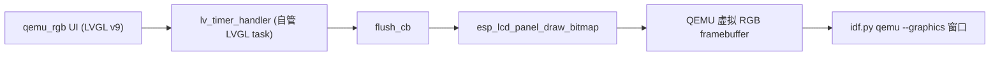

# QEMU 虚拟 RGB 面板 LVGL 例程 — 设计文档（Spec）

- 日期：2026-07-01
- 状态：已评审（方案与命名经用户确认）
- 主题：在 PC 上用 QEMU 模拟运行、直接查看 LVGL UI 的新例程
- 关联分支 / PR：`cursor/lvgl-qemu-rgb-8883`（拟作为 PR3）

## 1. 背景与目标

本仓库 ESP-Pocket2 是面向 ESP32-S3 的 ESP-IDF（v5.5.4）固件工程，硬件屏是 ST7789（SPI）。现有 LVGL 例程入口 [main/main_lvgl.c](https://github.com/yuangezhizao/ESP-Pocket2/blob/dev/main/main_lvgl.c) 依赖 [main/lvgl/hp28008.c](https://github.com/yuangezhizao/ESP-Pocket2/blob/dev/main/lvgl/hp28008.c)（ST7789 + GT911）。它在 QEMU 下看不到画面，原因有二：一是启动早期 `axp202_init()` 会真正操作 I2C 总线，QEMU 无 I2C 从机导致等待 ACK 阻塞；二是 ST7789 是 SPI 物理屏，QEMU 不模拟。

目标：新增一个**仅用于 QEMU** 的 LVGL 例程，借助官方虚拟 RGB 帧缓冲设备，使开发者可用 `idf.py qemu --graphics` 在 PC 上直接看到 LVGL 渲染，无需烧录开发板，从而快速迭代 UI。

## 2. 需求

功能需求：
- 新增独立入口与实现文件夹，构建出的固件在 QEMU 中启动后，通过 `--graphics` 窗口显示一段 LVGL UI。
- 不触碰、也不破坏现有 ST7789 例程；demo 之间通过 [main/CMakeLists.txt](https://github.com/yuangezhizao/ESP-Pocket2/blob/dev/main/CMakeLists.txt) 的 `SRCS` 注释切换（沿用本仓库既定机制）。
- 例程不依赖 QEMU 不存在的外设（AXP202/BM8563/DRV2605/GT911/SD 卡/ST7789）。

非功能需求：
- 与官方例程保持可追溯的一致性（命名、结构对齐上游），便于后续维护与升级。
- 与项目现有 LVGL 版本（v9.5）兼容；不得引入第二个 LVGL 版本。
- 改动最小、低风险；与现有例程运行时解耦，构建层面会常驻依赖（esp_lcd_qemu_rgb + lvgl_qemu_rgb/*.c）。

## 3. 关键约束（决定“照抄”方式）

官方例程 [lcd_qemu_rgb_panel](https://github.com/espressif/idf-extra-components/tree/master/esp_lcd_qemu_rgb/examples/lcd_qemu_rgb_panel) 使用 **LVGL 8.3 的裸 `lv_disp_drv` API**（`lv_disp_drv_init` / `lv_disp_draw_buf_init` / `lv_disp_drv_register` / `flush_cb(lv_disp_drv_t*, ...)`）。本项目 [main/idf_component.yml](https://github.com/yuangezhizao/ESP-Pocket2/blob/dev/main/idf_component.yml) 固定 `lvgl/lvgl: "^9.5.0"`。一个工程只能有一个 LVGL 主版本，因此**以项目的 v9 为准，照搬官方结构并把 v8 API 适配为 v9**，无法逐字复制。

可行性依据（官方明确支持 ESP32-S3）：官方文档 [QEMU 模拟器 v5.5.4](https://docs.espressif.com/projects/esp-idf/zh_CN/v5.5.4/esp32s3/api-guides/tools/qemu.html) 指出——“乐鑫维护了一个 QEMU 模拟器的分支，支持 ESP32-S3……QEMU 支持虚拟帧缓冲设备……要在应用程序中使用虚拟帧缓冲设备，可以将 `espressif/esp_lcd_qemu_rgb` 组件添加到项目中……`idf.py qemu --graphics` 会打开一个额外的窗口，显示帧缓冲内容”。

组件事实（读源码确认）：`espressif/esp_lcd_qemu_rgb` v1.0.2，仅依赖 `idf>=5.3`，无 target 限制。核心 API `esp_lcd_new_rgb_qemu(&cfg, &panel)` 返回**标准 `esp_lcd_panel_handle_t`**，`cfg` 含 `width/height/bpp`（`RGB_QEMU_BPP_16` 或 `RGB_QEMU_BPP_32`）。它通过读取 `SYSCON_DATE_REG - 4` 是否等于 "QEMU" 判断运行环境，真实硬件会返回 `ESP_ERR_NOT_SUPPORTED`——所以该入口天然只服务于 QEMU。

## 4. 方案选择

采用**方案 1：自管 LVGL（照搬官方结构 + 适配 v9），独立入口**。

- 不使用 `esp_lvgl_port`：QEMU RGB panel 的 `draw_bitmap` 是同步写虚拟帧缓冲，天然契合官方的 `flush_cb` + `flush_ready` 模型；自管 LVGL 可最大程度忠实于上游、规避对 `esp_lvgl_port` 处理“无 io_handle 同步面板”的兼容性未知风险。
- 独立入口 + 独立文件夹：与 ST7789 例程运行时解耦；构建层面会常驻依赖（esp_lcd_qemu_rgb + lvgl_qemu_rgb/*.c）。

未选方案（作为后续演进，命名已预留）：
- 方案 2：走项目现有 `esp_lvgl_port`（`lvgl_port_add_disp`），可复刻 hp28008 的 logo+文字 UI；后续入口 `main_lvgl_qemu_rgb_port.c` ↔ `main/lvgl_qemu_rgb_port/`。
- 方案 3：单入口 + Kconfig 编译期在 `hp28008.c` 内切 ST7789 / QEMU-RGB；不新增入口，改 `main_lvgl.c` + `CONFIG_HP28008_USE_QEMU_RGB`。

三方案的显示后端相同（都是 QEMU RGB 虚拟面板），真正区别在 **LVGL 接入方式**，故命名以“接入方式”区分（`_port` / Kconfig），而非以 `qemu`/`rgb` 区分。

## 5. 命名（方案 A，已确认）

沿用 `main_lvgl.c` ↔ `main/lvgl/` 的配对惯例：
- 入口薄壳：`main/main_lvgl_qemu_rgb.c`
- 实现文件夹：`main/lvgl_qemu_rgb/`

`qemu` 表“仅模拟器可用”，`rgb` 对齐官方组件名 `esp_lcd_qemu_rgb` 与官方例程 `lcd_qemu_rgb_panel`，便于溯源。

## 6. 架构

### 6.1 文件结构（单元职责）

- `main/main_lvgl_qemu_rgb.c`：入口薄壳，仅 `app_main()`，调用实现文件夹导出的启动函数。职责单一：作为可被 CMake 切换的 demo 入口。
- `main/lvgl_qemu_rgb/lvgl_qemu_rgb.h`：对外声明启动函数与（可选）配置宏。
- `main/lvgl_qemu_rgb/lvgl_qemu_rgb.c`：建 QEMU RGB panel + 自管 LVGL v9（分配 draw buffer、创建 `lv_display`、注册 flush、esp_timer tick、LVGL task）。
- `main/lvgl_qemu_rgb/lvgl_demo_ui.c`：UI（散点图，照搬官方并适配 v9）。

### 6.2 数据流

## 7. 关键设计决策

- 符号命名（**必须**）：本仓库 [main/CMakeLists.txt](https://github.com/yuangezhizao/ESP-Pocket2/blob/dev/main/CMakeLists.txt) 用 `file(GLOB_RECURSE ...)` 收编所有模块 `.c`，`hp28008.c` 与新例程会同时进入链接。`hp28008.c` 的 `app_lcd_init/app_touch_init/app_lvgl_init/app_main_display` 均为全局符号。新例程所有跨文件/导出函数一律加 `qemu_rgb_` 前缀，其余 `static`，避免重复定义链接错误。
- 面板配置：`esp_lcd_rgb_qemu_config_t{ .width=800, .height=480, .bpp=RGB_QEMU_BPP_16 }`（RGB565，与 LVGL v9 默认 16bpp 一致）。随后 `esp_lcd_panel_reset` + `esp_lcd_panel_init`。
- LVGL v8→v9 适配：`lv_disp_drv_*` 系列 → `lv_display_create` + `lv_display_set_flush_cb` + `lv_display_set_buffers`；flush 回调改用 v9 签名并以 `lv_display_flush_ready` 收尾；panel handle 经 `lv_display_set_user_data` 传递；`lv_disp_get_scr_act` → `lv_display_get_screen_active`。
- draw buffer：内部 RAM 分配约 10 行（`800*10*sizeof(lv_color_t)` ≈ 16KB），`LV_DISPLAY_RENDER_MODE_PARTIAL`。不启用官方的“专用帧缓冲（dedicated FB）”分支以简化首版。
- 字节序：QEMU 直接写内存帧缓冲，flush **不做** swap（区别于 hp28008 给 SPI 用的 `swap_bytes=true`）。
- UI 与回退：散点图主体 `lv_chart_*` 在 v9 可直用；官方 v8 的“逐点渐变上色”回调（`LV_EVENT_DRAW_PART_BEGIN` + `lv_obj_draw_part_dsc_t`）在 v9 改为 draw-task 事件模型，移植较繁琐。为“先看效果”，首版实现**不带逐点渐变**的散点图（单色即可）确保跑通；逐点渐变作为后续可选增强。
- 依赖：[main/idf_component.yml](https://github.com/yuangezhizao/ESP-Pocket2/blob/dev/main/idf_component.yml) 增 `esp_lcd_qemu_rgb: "^1.0.2"`；`lvgl/lvgl` 保持 `^9.5.0`。
- 构建切换：[main/CMakeLists.txt](https://github.com/yuangezhizao/ESP-Pocket2/blob/dev/main/CMakeLists.txt) 新增 `LVGL_QEMU_RGB_C_SOURCES` GLOB 与 `INCLUDE_DIRS "lvgl_qemu_rgb"`；`SRCS` 注释 `main_sd_card.c`、启用 `main_lvgl_qemu_rgb.c`，并把新入口并入注释备选清单。

## 8. 错误处理

- `esp_lcd_new_rgb_qemu` 在真机返回 `ESP_ERR_NOT_SUPPORTED`；例程用 `ESP_ERROR_CHECK` 快速失败并在日志中明确“本例程仅用于 QEMU”。
- 各 `esp_lcd_*`/`esp_timer_*` 调用统一 `ESP_ERROR_CHECK`；draw buffer 分配失败以 `assert` 暴露（与官方一致）。

> ⚠️ 更正（2026-07-04，复审 PR3-1/PR3-3/PR5-2）：本 spec 描述的是 PR3 首版设计，以下三点均已在后续演进中修正：
>
> 1. draw buffer 用 `malloc` → PR#5 改为 `heap_caps_malloc(..., MALLOC_CAP_INTERNAL | MALLOC_CAP_8BIT)`（强制 internal RAM）。
> 2. 硬编码 RGB565 → PR#5 改为随 `LV_COLOR_DEPTH` 的色深宏推导。
> 3. 分配失败以 `assert` 暴露 → PR#7 把 `lv_display_create`/互斥量/`xTaskCreate`/buffer 分配等失败改为返回 `esp_err_t`（`ESP_RETURN_ON_*`）。
>
> 最新实现以 `docs/superpowers/*/2026-07-02-*` 与代码为准。

## 9. 验证策略

- 构建：`idf.py build`（全新环境经 `sdkconfig.defaults` 自动选 esp32s3）；重点排查符号冲突与 v9 API 编译错误。
- 图形验证（主）：QEMU 的虚拟 RGB 帧缓冲设备由 `--graphics` 提供，故必须 `DISPLAY=:1 idf.py qemu --graphics` 才能让 `esp_lcd_new_rgb_qemu` 成功并渲染出画面；日志应出现面板/LVGL 初始化与 UI 启动，窗口显示 UI，截图留证。
- 无图形冒烟：`timeout 40 idf.py qemu --qemu-extra-args "-no-reboot"` 仅确认固件能在 QEMU 启动到 `app_main`；不带 `--graphics` 时虚拟帧缓冲不存在，`esp_lcd_new_rgb_qemu` 可能返回 `ESP_ERR_NOT_SUPPORTED` 而提前失败，属预期、不代表 feature 有问题。
- 体积：`idf.py size` 供参考（对齐 CI）。

本仓库无单测 / lint，验证以“构建通过 + QEMU 启动日志（+ 可选截图）”为准。

## 10. 后续演进

- 方案 2（`_port`）：用 `esp_lvgl_port` 接同一 QEMU RGB panel，复刻 hp28008 UI。
- 方案 3（Kconfig）：`hp28008.c` 内编译期切后端，UI/逻辑 100% 复用。
- UI 增强：完整还原官方散点图逐点渐变（v9 draw-task 事件）。

## 11. QA 记录

1. **QA1**：方案 2/3 可否在方案 1 之后再叠加？
   - 可以。方案 1 独立入口 + 独立文件夹，与 ST7789 例程解耦，后续叠加互不影响。

2. **QA2**：入口命名？
   - 采用方案 A（`main_lvgl_qemu_rgb.c` ↔ `main/lvgl_qemu_rgb/`）；方案 2/3 用 `_port` 后缀 / Kconfig 区分（区分维度是 LVGL 接入方式，而非显示后端）。

3. **QA3**：是否允许把 spec/plan 文档提交入库？
   - 用户已明确授权本次提交；spec 落 `docs/superpowers/specs/`、plan 落 `docs/superpowers/plans/`，并删除 `artifacts/plans/` 下由 CreatePlan 生成的临时计划。

4. **QA4**：spec 与 plan 应合并为一个提交还是分开？
   - 合并为一个（同一次设计产出的配套文档，属同一逻辑单元；分开价值不大）。

5. **QA5**：commit message 中官方参照如何处理？
   - 统一用「参照:」（对齐仓库既有风格），各提交参照分布：Task1 依赖提交放组件注册中心链接（components.espressif.com），Task2 源码提交放 QEMU 官方文档 + idf-extra-components 组件根目录，Task3 CMakeLists 与 Docs 提交不带参照。

6. **QA6**：Review 指出的 5 条问题如何处理？
   - 第 1、2、4 条已处理（QEMU 验证改为 `--graphics` 主验证；spec "零副作用"改为"运行时解耦，构建层面常驻"；Task1 依赖改为仅追加一行，避免注释 churn）；第 3 条（`lv_display_create`/`xTaskCreate` 失败检查）和第 5 条（CC0/Apache 许可证表述）暂记录、后续按需处理。

7. **QA7**：例程默认的 UI 内容与显示参数是什么？
   - UI=官方散点图（v9 适配，首版先去逐点渐变）；分辨率/色深=800×480 / RGB565(16bpp)。

8. **QA8**：spec 第 7 节"draw buffer：内部 RAM 分配约 10 行，`LV_DISPLAY_RENDER_MODE_PARTIAL`，不启用 dedicated FB 分支"如何理解？
   - **为什么需要 draw buffer**：LVGL 不直接写屏幕，而是先把 UI 元素画进中间内存（draw buffer），再由 `flush_cb` 把这块内存搬到屏幕驱动（本例为 `esp_lcd_panel_draw_bitmap`）。
   - **"10 行"的含义**：draw buffer 高度仅 10 像素，宽度 800 像素；内存占用 `800×10×sizeof(lv_color16_t)` = **16KB**（而整屏 768KB），从 ESP32-S3 内部 RAM 分配。
   - **`LV_DISPLAY_RENDER_MODE_PARTIAL`**：分块渲染模式——LVGL 把脏区拆成不超过 draw buffer 大小的块，逐块渲染 → `flush_cb` → `flush_ready`，循环至整帧刷完。省内存，对 demo 散点图帧率完全够用。
   - **为什么不用 dedicated FB**：官方例程提供 `CONFIG_EXAMPLE_QEMU_RGB_PANEL_DEDIC_FB` 选项，打开后可调 `esp_lcd_rgb_qemu_get_frame_buffer()` 拿到 QEMU 专用帧缓冲（物理地址 `0x20000000`，768KB），LVGL 直接渲染到 QEMU 内存实现零拷贝。但该路径需要额外分支逻辑、代码复杂度翻倍；首版目标是"先看效果"，故选择 partial 模式以保持代码最简单。

## 12. 参考

- 官方例程：https://github.com/espressif/idf-extra-components/tree/master/esp_lcd_qemu_rgb/examples/lcd_qemu_rgb_panel
- 官方组件：https://github.com/espressif/idf-extra-components/tree/master/esp_lcd_qemu_rgb
- 官方文档：https://docs.espressif.com/projects/esp-idf/zh_CN/v5.5.4/esp32s3/api-guides/tools/qemu.html
- esp-bsp `rgb_lcd`（对照：真实 RGB 外设，**不能** QEMU 跑）：https://github.com/espressif/esp-bsp/tree/master/components/esp_lvgl_port/examples/rgb_lcd
