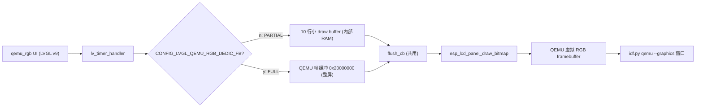

# QEMU 虚拟 RGB 面板 LVGL 例程 — Dedicated FB 模式与官方 UI 对齐（设计文档 / Spec）

- 日期：2026-07-02
- 状态：已评审（方案与逐项决策经用户确认）
- 主题：为 PR3 的 QEMU RGB 例程补齐官方的 Dedicated FB 渲染路径（Kconfig 可切），并把 UI 对齐官方（色深处理、逐点渐变、刷新周期）
- 关联分支 / PR：`cursor/qemu-rgb-dedicated-fb-fc50`（[PR #5](https://github.com/yuangezhizao/ESP-Pocket2/pull/5)，base `dev`）
- 前序：[docs/superpowers/specs/2026-07-01-lvgl-qemu-rgb-design.md](https://github.com/yuangezhizao/ESP-Pocket2/blob/dev/docs/superpowers/specs/2026-07-01-lvgl-qemu-rgb-design.md)（PR3，仅实现 Partial 模式）

## 1. 背景与目标

PR3 照抄官方例程 `lcd_qemu_rgb_panel` 时，为"先看效果"只实现了 Partial 分块渲染模式，并主动省略了官方的"专用帧缓冲（Dedicated FB）"分支与部分 UI 细节（逐点渐变、坐标轴刻度）。官方例程通过 Kconfig 开关 `CONFIG_EXAMPLE_QEMU_RGB_PANEL_DEDIC_FB` 在两种渲染路径间切换：关闭时从内部 RAM 分配 10 行的小 draw buffer 走 Partial；开启时直接把 QEMU 虚拟面板自带的帧缓冲当作 LVGL draw buffer 走整屏刷新，实现零拷贝。

目标：在现有 `main/lvgl_qemu_rgb/` 例程上补齐 Dedicated FB 渲染路径与配套 Kconfig 开关，并把 UI 对齐官方（补色深/颜色格式处理、逐点渐变、刷新周期），使本例程在"渲染模式"与"UI 呈现"两个维度都与官方例程一致（LVGL 版本差异与 v9 已移除能力除外），便于溯源与后续维护。

## 2. 需求

功能需求：
- 新增 Kconfig 开关 `CONFIG_LVGL_QEMU_RGB_DEDIC_FB`（默认关闭）；关闭时行为与 PR3 现状完全一致（Partial），开启时改用 QEMU 专用帧缓冲 + 整屏刷新。
- UI 对齐官方：补齐"逐点渐变"（旧点更透明、按 x/y 值在红↔蓝之间过渡）与刷新周期（100ms）；补齐色深/颜色格式处理（跟随 `LV_COLOR_DEPTH` 选 16/32 并带兜底）。
- 保留 PR3 额外添加的顶部提示 label（`"Hello Espressif & LVGL on QEMU RGB"`）。

非功能需求：
- 与官方例程保持可追溯的一致性；两种渲染模式共用同一 `flush_cb` 与 UI。
- 与项目现有 LVGL v9.5 兼容，不引入第二个 LVGL 版本。
- 默认构建行为不变（默认 Partial），改动最小、低风险。

非目标（YAGNI）：
- 坐标轴刻度不补齐（原因见 7.7 与 QA1）。
- 不做 PR3 遗留的方案 2（`esp_lvgl_port` 接入）、方案 3（Kconfig 编译期切后端）。

## 3. 关键约束（Dedicated FB 的 v8 → v9 适配）

官方例程使用 LVGL 8.3 的裸 `lv_disp_drv` API，Dedicated FB 时设 `disp_drv.full_refresh = true` 并把 `esp_lcd_rgb_qemu_get_frame_buffer()` 返回的帧缓冲作为唯一 draw buffer，`lv_disp_draw_buf_init` 的尺寸参数以"像素数"计。本项目锁定 LVGL v9.5，需转译如下：

- 渲染模式：v8 `full_refresh = true` → v9 `LV_DISPLAY_RENDER_MODE_FULL`；Partial 隐式默认 → 显式 `LV_DISPLAY_RENDER_MODE_PARTIAL`。
- 缓冲尺寸语义：v8 传"像素数"→ v9 `lv_display_set_buffers()` 传"字节数"，故 Dedicated FB 用 `W*H*每像素字节`、Partial 用 `W*行数*每像素字节`。
- 颜色格式：v9 需显式 `lv_display_set_color_format()`，`lv_color_t` 不再随 `LV_COLOR_DEPTH` 决定缓冲每像素字节，故每像素字节数改由色深宏推导（见 7.1）。

组件事实（读 `esp_lcd_qemu_rgb` v1.0.2 源码确认）：
- `esp_lcd_rgb_qemu_get_frame_buffer(panel, &fb)` 返回固定物理地址 `0x20000000` 的帧缓冲指针，恒 `ESP_OK`。
- `rgb_qemu_draw_bitmap()` 本身不做 memcpy：它把 `color_data` 指针写入虚拟设备寄存器 `update_content`、置 `update_st.ena=1` 触发 QEMU 读取，并自旋等待 `while(update_st.ena==1){}` 直到 QEMU 读完（天然防撕裂）。因此 QEMU 端把 `color_data` 当作"area 尺寸的紧凑 bitmap"读取。
- 另有 `esp_lcd_rgb_qemu_refresh(panel)`（等价于 `draw_bitmap(0,0,W,H, 0x20000000)`）；本例程不需要——`flush_cb` 里的 `draw_bitmap` 已触发刷新。

由上一条推出一个关键约束：**Dedicated FB 不能配合 DIRECT 模式，只能整屏刷新（v9 `LV_DISPLAY_RENDER_MODE_FULL`、对应 v8 `full_refresh=true`）**。此限制的根源是 QEMU 组件的 `draw_bitmap`（按"area 尺寸紧凑 bitmap"读取、不处理 stride），与 LVGL 版本无关——因此 v8 时 Dedicated FB 同样不能用 `direct_mode`。DIRECT 模式只重绘脏区，flush 的 `px_map` 指向整屏帧缓冲内脏区左上角、在整屏 stride 下非紧凑，传给按紧凑 bitmap 读取的 QEMU 会逐行错位；FULL 模式每次 flush 的 area 是整屏、`px_map` 为帧缓冲起始（紧凑、stride 匹配），故正确。官方 v8 选 `full_refresh=true` 正是规避此问题。对照：真实 RGB LCD 面板驱动的 `draw_bitmap` 支持 stride/gap，可用 DIRECT + 双帧缓冲做部分刷新；QEMU 虚拟组件未实现 stride 处理，故只能整屏 FULL。

## 4. 方案选择

采用**方案 A：沿用官方结构，抽 buffer 分派辅助函数 + `#if` 分支，Kconfig 开关**。

- 在 `lvgl_qemu_rgb.c` 内抽 `qemu_rgb_lvgl_setup_buffers()`（对应官方 `example_lvgl_get_buffers()`），用 `#if CONFIG_LVGL_QEMU_RGB_DEDIC_FB` 分派 Dedicated FB / Partial；`flush_cb` 两模式共用。
- 开关用 Kconfig（对齐官方，项目已有 `main/Kconfig.projbuild` 基础设施；`menuconfig` 可视化切换、可被 CI 用 `-D` 覆盖），默认 `n` 保持现状行为。

未选方案：
- 方案 B：源码顶部 `#define` 宏切换——需改代码才能切，弱于 Kconfig，且不对齐官方。
- 方案 C：运行时参数——Dedicated FB 与 Partial 的缓冲/渲染模式在建 display 时一次性确定，运行时切换无实际价值，徒增复杂度。

## 5. 命名（Kconfig）

采用项目专属前缀 `CONFIG_LVGL_QEMU_RGB_DEDIC_FB`，menu 名 `"LVGL QEMU RGB Example Configuration"`。不逐字照抄官方的 `CONFIG_EXAMPLE_QEMU_RGB_PANEL_DEDIC_FB`：其一，本仓库 `main/Kconfig.projbuild` 里 SD card 一节已大量使用 `EXAMPLE_*` 前缀，再引入 `EXAMPLE_QEMU_RGB_PANEL_*` 易混淆；其二，`LVGL_QEMU_RGB_*` 与实现文件夹 `lvgl_qemu_rgb/` 同名，语义清晰、便于定位。

## 6. 架构

### 6.1 改动的单元

- `main/Kconfig.projbuild`：末尾新增独立 menu 与开关 config（唯一职责：暴露 Dedicated FB 开关）。
- `main/lvgl_qemu_rgb/lvgl_qemu_rgb.c`：新增色深宏推导与 `qemu_rgb_lvgl_setup_buffers()`；`qemu_rgb_lvgl_run()` 改为调用该辅助函数并按色深设 `lv_display_set_color_format()`。
- `main/lvgl_qemu_rgb/lvgl_demo_ui.c`：新增 v9 draw-task 渐变回调、开启 chart 的 draw-task 事件、刷新周期 100ms；保留顶部 label。

### 6.2 两种渲染模式对比

```
Partial 模式（默认 / CONFIG_LVGL_QEMU_RGB_DEDIC_FB=n）
  LVGL 画进内部 RAM 的 10 行小 buffer（约 16KB）
    -> flush_cb: draw_bitmap(area, px_map=小buffer)  逐块提交
    -> QEMU 从该指针读 area 尺寸数据写虚拟帧缓冲 -> 显示
  render mode = LV_DISPLAY_RENDER_MODE_PARTIAL

Dedicated FB 模式（CONFIG_LVGL_QEMU_RGB_DEDIC_FB=y）
  LVGL 直接画进 QEMU 帧缓冲 0x20000000（整屏，16bpp 时 768KB）
    -> flush_cb: draw_bitmap(整屏 area, px_map=帧缓冲起始)  零拷贝
    -> QEMU 从帧缓冲读整屏 -> 显示
  render mode = LV_DISPLAY_RENDER_MODE_FULL
```

### 6.3 数据流



## 7. 关键设计决策

### 7.1 色深 / 颜色格式（对齐官方，v9 转译）

官方按 `#if CONFIG_LV_COLOR_DEPTH_32 / _16` 选 `RGB_QEMU_BPP_32 / 16` 并带 `#else #error` 兜底。本项目在 v9 下等价还原：由同一组宏同时推导三样东西——面板 `bpp`、`lv_display_set_color_format()` 的格式（32→`LV_COLOR_FORMAT_XRGB8888`，16→`LV_COLOR_FORMAT_RGB565`）、缓冲每像素字节数 `QEMU_LVGL_BYTES_PER_PX`（32→4，16→2）；其余色深 `#error` 兜底。这替换掉 PR3 里硬编码的 `RGB_QEMU_BPP_16` / `lv_color16_t`。

### 7.2 缓冲分派（`qemu_rgb_lvgl_setup_buffers`）

`#if CONFIG_LVGL_QEMU_RGB_DEDIC_FB`：`esp_lcd_rgb_qemu_get_frame_buffer()` 取帧缓冲，`buf_size = W*H*QEMU_LVGL_BYTES_PER_PX`，`LV_DISPLAY_RENDER_MODE_FULL`；`#else`：`heap_caps_malloc(W*10*QEMU_LVGL_BYTES_PER_PX, MALLOC_CAP_INTERNAL | MALLOC_CAP_8BIT)`（强制 Partial draw buffer 落 internal RAM，规避开 PSRAM 时落 PSRAM 导致 QEMU esp_rgb 黑屏，见第 12 节），`LV_DISPLAY_RENDER_MODE_PARTIAL`。两分支日志分别为 "Use QEMU dedicated frame buffer as LVGL draw buffer" 与 "Allocate separate LVGL draw buffer"（对齐官方）。分配/取帧缓冲的失败处理见第 8 节（PR#7 已改为返回 `esp_err_t`）。

### 7.3 FULL 而非 DIRECT（v8/v9 皆然）

见第 3 节末的约束推导：限制根源是 QEMU 组件 `draw_bitmap` 按"紧凑 bitmap"读取 `color_data`、不处理 stride，与 LVGL 版本无关。只有 FULL（整屏 area、px_map 为帧缓冲起始）能保证 stride 匹配；DIRECT 的脏区子块在整屏 stride 下非紧凑会逐行错位。故 Dedicated FB 固定用 FULL（v8 对应 `full_refresh=true`，而非 `direct_mode`）。

### 7.4 flush_cb 两模式共用

现有 `qemu_rgb_lvgl_flush_cb`（`esp_lcd_panel_draw_bitmap(...)` + `lv_display_flush_ready`）无需改动：Partial 下 px_map 是紧凑小 buffer、area 是块；FULL 下 px_map 是帧缓冲起始、area 是整屏，二者对 QEMU 都是紧凑 bitmap。`draw_bitmap` 内部自旋等待，天然防撕裂，无需额外 `esp_lcd_rgb_qemu_refresh`。

### 7.5 逐点渐变（以 v9 官方 `lv_example_chart_7.c` 为准）

v9 的 draw part 事件模型改变：`lv_obj_add_event_cb(chart, cb, LV_EVENT_DRAW_TASK_ADDED, NULL)` + `lv_obj_add_flag(chart, LV_OBJ_FLAG_SEND_DRAW_TASK_EVENTS)`；回调里 `lv_draw_task_get_draw_dsc()` 取 `lv_draw_dsc_base_t`（`part != LV_PART_INDICATOR` 则 return，绘制序号用 `id2`），`lv_draw_task_get_fill_dsc()` 取 `lv_draw_fill_dsc_t` 设 `opa`（旧点更透明）与 `color`（`lv_color_mix(RED, BLUE, x_opa+y_opa)`），点数组用 `lv_chart_get_series_x_array/y_array`。功能与官方 v8 `draw_event_cb` 等价。

### 7.6 刷新周期

`qemu_rgb_add_data` 定时器周期由 PR3 的 200ms 改回官方的 100ms。

### 7.7 坐标轴刻度不补齐（记录在案）

官方 v8 用 `lv_chart_set_axis_tick()` 在 chart 上直接画 X+Y 双轴刻度，但 v9.5.0 的 `lv_chart.h` 已移除该 API（仅剩 `set_axis_range/min_value/max_value`），且 v9 官方 scatter 示例 `lv_example_chart_7` 本身不带刻度。v9 要加刻度只能用独立的 `lv_scale` 组件外挂两个刻度并手工对齐 chart 绘图区（range 对齐、padding 偏移），实现方式与官方（chart 内建）本质不同、视觉只能近似、代码成本不低于逐点渐变，而对"验证渲染"这一 demo 目的收益很低。故本次不补，列为后续可选增强（见第 9 节）。

### 7.8 保持 PR3 既有风格（非版本差异，刻意保留）

以下与官方的差异是 PR3 融入本仓库工程 + 项目规范的刻意选择，本次不改：四件套文件组织（入口薄壳 + 实现 + 头文件 + UI）、`qemu_rgb_` 符号前缀与 `static` 可见性（防 GLOB 一起编译时与 `hp28008.c` 等符号冲突）、`CMakeLists.txt` GLOB 工程集成与 `SRCS` 注释切 demo、Apache-2.0 + `SPDX-FileContributor` 版权头、以及错误处理分层（见第 8 节）。

## 8. 错误处理

与官方的差异（PR3 已定，本次保持）：官方在 `void app_main` 里全程 `ESP_ERROR_CHECK`（建面板失败即 abort）；本项目把逻辑放在返回 `esp_err_t` 的 `qemu_rgb_lvgl_run()`，唯独建面板 `esp_lcd_new_rgb_qemu()` 用 `ESP_RETURN_ON_ERROR` 先打印 "only runs in QEMU" 可读提示再返回错误码，其余步骤仍 `ESP_ERROR_CHECK`。因入口薄壳是 `ESP_ERROR_CHECK(qemu_rgb_lvgl_run())`，真机上最终仍会 abort，但先给出可读定位信息。Dedicated FB 取帧缓冲用 `ESP_ERROR_CHECK`（对齐官方；该 API 恒 `ESP_OK`）。`xTaskCreate`/`lv_display_create` 返回值两者均未检查（PR3 已记录为后续按需处理）。**更正（2026-07-04，PR#7）**：`lv_display_create`/递归互斥量/`xTaskCreate` 与 Partial buffer 分配已改为 `ESP_RETURN_ON_FALSE` 返回 `esp_err_t`，Dedicated FB 取帧缓冲由 `ESP_ERROR_CHECK` 改为 `ESP_RETURN_ON_ERROR`；`qemu_rgb_lvgl_setup_buffers` 相应返回 `esp_err_t`。

## 9. 验证策略

- 构建两遍：默认 `idf.py build`（Partial）；Dedicated FB 用独立 build 目录 + 独立 sdkconfig + `SDKCONFIG_DEFAULTS` 覆盖（`idf.py -D CONFIG_LVGL_QEMU_RGB_DEDIC_FB=y` 仅写入 CMake CACHE，不影响 C 代码实际读的 `sdkconfig.h`，故不能用该方式；必须同时指定 `-DSDKCONFIG=build-dedic/sdkconfig` 让 kconfgen 使用独立 sdkconfig 文件）：`printf 'CONFIG_LVGL_QEMU_RGB_DEDIC_FB=y\n' > /tmp/sdkconfig_dedic_extra && idf.py -B build-dedic -DSDKCONFIG=build-dedic/sdkconfig -DSDKCONFIG_DEFAULTS="sdkconfig.defaults;/tmp/sdkconfig_dedic_extra" build`，确认两分支均编译通过、无符号冲突、无 v9 API 错误。验证 `build-dedic/sdkconfig` 与 `build-dedic/config/sdkconfig.cmake` 均含 `CONFIG_LVGL_QEMU_RGB_DEDIC_FB=y`。
- 图形验证（主）：`DISPLAY=:1 idf.py qemu --graphics --qemu-extra-args "-no-reboot"`，两模式均应显示顶部 label + 居中动态渐变散点图；Dedicated FB 日志出现 "Use QEMU dedicated frame buffer..."。若平台无 DISPLAY，则至少无图形冒烟确认启动到 `app_main`，并在 PR 注明图形验证待补。
- 渲染正确性矩阵（关键，防 PSRAM 黑屏回归）：对 **PSRAM off/on × Partial/Dedicated FB 四种组合**分别构建并 `--graphics` 运行，逐一核对 `[DIAG]` 的 buffer 落点（INTERNAL/PSRAM/vram）、`[ESP RGB] Invalid color content` 告警数、模拟器画面截图；Partial 必须 buffer 落 INTERNAL 且画面正常（见第 12 节缺陷复盘）。
- 体积：`idf.py size` 对照两模式（Dedicated FB 省去 16KB 内部 draw buffer；整屏 768KB 位于 QEMU 硬件区，不占常规堆）。

本仓库无单测 / lint。验证以「构建通过 + QEMU 启动日志 + 画面截图核对（含 [DIAG] 配置自证）」为准——图形类改动必须核对模拟器画面，不能只看日志（见第 12 节缺陷复盘：本 bug 正因当初只看日志而漏掉）。

## 10. 后续演进（本次不含）

- 坐标轴刻度：用 `lv_scale` 外挂还原 X+Y 双轴刻度（视觉近似）。
- PR3 遗留：方案 2（`esp_lvgl_port`）、方案 3（Kconfig 编译期切后端）。

## 11. QA 记录

1. **QA1（坐标轴刻度为何不补）**：v9.5.0 chart 已移除 `lv_chart_set_axis_tick`，官方 v9 scatter 示例本身也不带刻度；用 `lv_scale` 外挂只能近似且成本高、对 demo 收益低。故不补，列为后续可选增强。

2. **QA2（开关为何用 Kconfig 而非宏 / 运行时）**：Kconfig 对齐官方、项目已有基础设施、`menuconfig` 可视化且 CI 可 `-D` 覆盖；渲染模式在建 display 时一次性确定，运行时切换无价值。

3. **QA3（Dedicated FB 为何必须 FULL 不能 DIRECT；v8 能用 DIRECT 吗）**：不能，v8/v9 皆然。限制根源是 QEMU 组件 `draw_bitmap` 把 `color_data` 当紧凑 bitmap 读取、不处理 stride（非 LVGL 版本问题），故 v8 Dedicated FB 也只能 `full_refresh=true`。FULL 的整屏 px_map 紧凑、stride 匹配；DIRECT 的脏区子块在整屏 stride 下非紧凑会逐行错位。对照真实 RGB 面板驱动支持 stride 故可 DIRECT，QEMU 虚拟组件不支持故只能 FULL。

4. **QA4（色深处理如何对齐官方）**：由 `#if CONFIG_LV_COLOR_DEPTH_32/_16` 同时推导 bpp、color format、每像素字节，`#else #error` 兜底；替换 PR3 的硬编码 RGB565。

5. **QA5（错误处理与官方差异是否要抹平）**：不抹平。本项目的分层 + 建面板软失败提示是刻意的可读性增强，属项目规范，保留并记录。

6. **QA6（顶部 label 去留）**：保留。它是 PR3 额外添加、便于快速确认渲染成功的提示，官方无此 label 属可接受的增量差异。

7. **QA7（spec/plan 文档与 CreatePlan 临时计划的关系）**：用户明确授权按 superpowers 流程提交 spec/plan 到 `docs/superpowers/`，并删除 `CreatePlan` 生成的临时计划文件，仓库内只保留这一份，避免重复。

8. **QA8（Partial 黑屏根因，一句话）**：开 PSRAM 且 `malloc` 实际把 draw buffer 分配到 PSRAM 时（取决于 `SPIRAM_MALLOC_ALWAYSINTERNAL` 阈值等 allocator 策略），QEMU esp_rgb 设备只认 vram（`0x20000000`）/ internal DRAM 地址 → 每帧拒绝 → 黑屏；仅开 PSRAM 但 buffer 仍落 internal 时不复现。详见第 12 节。

9. **QA9（修复为何选方向 1）**：`heap_caps_malloc(buf_size, MALLOC_CAP_INTERNAL | MALLOC_CAP_8BIT)` 最小且精准，不改默认渲染模式，真机上小 draw buffer 放 internal RAM 通常也更稳、更符合实践；优于方向 2「默认改 Dedicated FB」（偏离默认对齐官方 Partial）与方向 3「保持裸 malloc」（开 PSRAM 工程会踩坑）。

10. **QA10（诊断去留与提交顺序）**：诊断 instrumentation 保留入库（供本地/CI 一眼自证配置生效）；提交顺序为 诊断 → 修复 → docs（用户确认）。

## 12. 缺陷复盘：Partial 模式在 PSRAM 下黑屏（根因 · 修复 · 验证）

### 12.1 现象

在开启 PSRAM 且 `malloc` 实际把 Partial draw buffer 分配到 PSRAM 的配置下，默认 Partial 模式 `idf.py qemu --graphics` 窗口全黑；串口日志一切正常（能跑到 `Display LVGL demo UI`）。PSRAM 关闭、或 buffer 仍落 internal 时正常。

### 12.2 根因

QEMU fork 的虚拟 RGB 设备 [`hw/display/esp_rgb.c`](https://github.com/espressif/qemu/blob/esp-develop/hw/display/esp_rgb.c) 的 `rgb_update()` 对 `update_content` 指针做地址校验：仅接受落在 `vram_as`（dedicated FB，`0x20000000`）或 `intram_as`（machine 传入的 internal DRAM，`0x3FC80000` + `0x170000`）内的地址，否则打印 `[ESP RGB] Invalid color content address or length` 并整帧跳过（屏幕保持 `rgb_invalidate` 的 `memset(0)` 黑）。开启 PSRAM 且 `malloc` 优先外部内存（如 `SPIRAM_MALLOC_ALWAYSINTERNAL` 阈值低于本 buffer 大小）而使 draw buffer 实际落在 PSRAM（`0x3C000000` 段）时，两个地址空间都不覆盖 → 每帧被拒 → 黑屏。Dedicated FB 的 buffer 恒为 vram，对 PSRAM 免疫。决定变量是 draw buffer 的实际落点，而非 PSRAM 编译开关本身。

### 12.3 云端复现矩阵（修复前，每格含 [DIAG] 日志自证 + 画面截图）

下表「Partial · on」行用 `CONFIG_SPIRAM_USE_MALLOC=y` + `CONFIG_SPIRAM_MALLOC_ALWAYSINTERNAL=0` 强制让 16KB draw buffer 落入 PSRAM 以暴露问题；仅开 PSRAM 但 buffer 仍落 internal 时不复现。

| 渲染模式 | PSRAM（buffer 实际落点） | buffer 落点（[DIAG]） | Invalid 告警 | 画面 |
|---|---|---|---|---|
| Partial | off | INTERNAL `0x3FC…` | 0 | 正常 |
| Partial | on（malloc 实际落 PSRAM） | PSRAM `0x3C…` | 大量 | 黑屏 |
| Dedicated FB | off | vram `0x20000000` | 0 | 正常 |
| Dedicated FB | on | vram `0x20000000` | 0 | 正常 |

### 12.4 诊断 instrumentation（先行提交、保留入库）

`qemu_rgb_lvgl_setup_buffers()` 填充 `[DIAG]` 字符串（render mode / buffer 地址 / 内存类型 INTERNAL·PSRAM·OTHER / 色深 / PSRAM 开关），经 `ESP_LOGW` 打印并由 `qemu_rgb_diag_str()` 提供给 GUI 底部 label 显示，解决「运行输出看不出 buffer 落点」的盲区（本地/CI 可一眼自证配置是否生效）。用 `esp_ptr_external_ram()` / `esp_ptr_internal()` 判定内存类型。

### 12.5 修复方案（方向 1，已确认）

Partial 分支 `malloc(buf_size)` → `heap_caps_malloc(buf_size, MALLOC_CAP_INTERNAL | MALLOC_CAP_8BIT)`（加 `#include "esp_heap_caps.h"`），强制 draw buffer 落 internal RAM；无论 PSRAM 是否开都不黑，真机上小 draw buffer 放 internal RAM 通常也更稳、更符合实践。不改默认渲染模式。未选方向 2（默认改 Dedicated FB，偏离「默认对齐官方 Partial」）与方向 3（保持裸 malloc，开 PSRAM 工程会踩坑）。

### 12.6 修复后验证矩阵（Task C，4 格 + [DIAG] 自证 + 画面截图）

修复（`heap_caps_malloc(MALLOC_CAP_INTERNAL | MALLOC_CAP_8BIT)`）后，用与 12.3 相同的配置（含 `SPIRAM_MALLOC_ALWAYSINTERNAL=0`）重跑 4 格，每格均有 [DIAG] 日志自证 + 截图确认画面：

| 渲染模式 | PSRAM | buffer 落点（[DIAG]） | Invalid 告警 | 画面 |
|---|---|---|---|---|
| Partial | off | INTERNAL `0x3fce9a94` | 0 | 正常 |
| Partial | on | INTERNAL `0x3fce9a40` | 0 | 正常（修复前为黑屏） |
| Dedicated FB | off | vram `0x20000000` | 0 | 正常 |
| Dedicated FB | on | vram `0x20000000` | 0 | 正常 |

关键格（Partial · PSRAM on）buffer 由 PSRAM(`0x3C…`) 变为 INTERNAL(`0x3FC…`)，Invalid 告警从修复前的 477 次降为 0，画面完全正常。

### 12.7 提交顺序（用户确认）

先提交诊断 instrumentation，再提交修复，最后把 spec + plan 的全部更新**合并为一次** docs 提交（即 plan 的 Task 6）。理由：诊断独立于修复、可单独复用；修复基于诊断确认的根因；文档统一在最后一次提交、避免多次 docs commit。均在分支 `cursor/qemu-rgb-dedicated-fb-fc50`（PR #5），保持 draft 直到画面验证通过。

### 12.8 验证方法改进（教训）

QEMU 图形类改动的验收必须包含「画面截图/像素核对 + [DIAG] 配置自证」，不能只看串口日志——本 bug 正因当初（PR #5 的 Task 5）只以日志为证而漏掉。云端可用 `DISPLAY=:1 ffmpeg -f x11grab -i :1 -frames:v 1 -y shot.png` 截图。

## 13. 参考

- 官方例程：https://github.com/espressif/idf-extra-components/tree/master/esp_lcd_qemu_rgb/examples/lcd_qemu_rgb_panel
- 官方组件：https://github.com/espressif/idf-extra-components/tree/master/esp_lcd_qemu_rgb
- LVGL v9 散点图渐变示例：https://github.com/lvgl/lvgl/blob/v9.5.0/examples/widgets/chart/lv_example_chart_7.c
- 官方文档（QEMU）：https://docs.espressif.com/projects/esp-idf/zh_CN/v5.5.4/esp32s3/api-guides/tools/qemu.html
- 前序设计（PR3）：[docs/superpowers/specs/2026-07-01-lvgl-qemu-rgb-design.md](https://github.com/yuangezhizao/ESP-Pocket2/blob/dev/docs/superpowers/specs/2026-07-01-lvgl-qemu-rgb-design.md)
