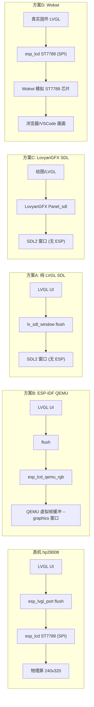
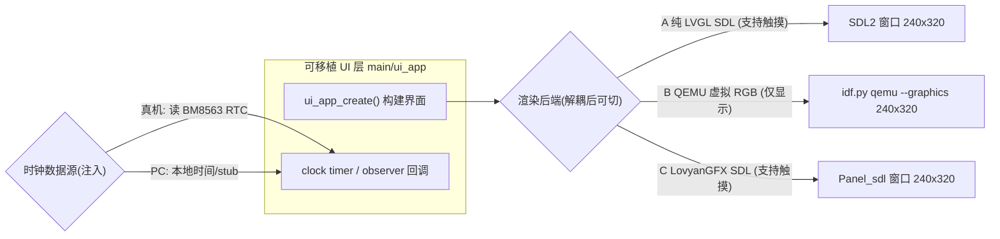

# hp28008 显示屏 LVGL 效果 PC 模拟 —— UI 解耦与多后端模拟（设计文档 / Spec）

- 日期：2026-07-03
- 状态：已实现（Task 1-5 全部完成并经 code review 通过；Task 6/附录 A 暂不执行）
- 主题：让 hp28008（ST7789，240x320）的 LVGL 界面无需烧录即可在电脑上查看/交互；核心前置是把 UI 从硬件解耦（记录“回调注入”与“LVGL v9 Observer/Subject”两种方法），随后可接 A(纯 LVGL SDL) / B(QEMU 虚拟面板) / C(LovyanGFX SDL) 任一后端
- 关联分支：`cursor/hp28008-lvgl-pc-sim-1073`（base `dev`）
- 前序：
  - [docs/superpowers/specs/2026-07-01-lvgl-qemu-rgb-design.md](https://github.com/yuangezhizao/ESP-Pocket2/blob/dev/docs/superpowers/specs/2026-07-01-lvgl-qemu-rgb-design.md)（PR3，QEMU RGB 例程 Partial）
  - [docs/superpowers/specs/2026-07-02-lvgl-qemu-rgb-dedicated-fb-design.md](https://github.com/yuangezhizao/ESP-Pocket2/blob/dev/docs/superpowers/specs/2026-07-02-lvgl-qemu-rgb-dedicated-fb-design.md)（PR5，Dedicated FB）

## 1. 背景与目标

PR3/PR5 已让 LVGL 能在 QEMU 上出图，但用的是 QEMU 专属的“虚拟 RGB 面板”（`esp_lcd_qemu_rgb`，800x480），是一段与真机 hp28008 完全独立的 demo（散点图），并未复用真机 UI，也无法体现 hp28008（ST7789，240x320）的实际界面。

真机 UI 目前嵌在 `main/lvgl/hp28008.c` 的 `app_main_display()` 里，且直接调用了 BM8563 RTC 硬件接口，导致这份 UI 只能在真机（或需要该硬件的环境）里跑，每次改 UI 都要烧录开发板才能看效果，迭代很慢。

目标：新增一种“在电脑上模拟 hp28008 的 LVGL 效果”的能力，免去每次烧录。为此先把真机 UI 从硬件解耦成一份可移植的 UI 层，再让它能被 PC 侧后端渲染（并支持鼠标模拟触摸交互）。本设计聚焦“解耦”这一方案无关的共同前置，并给出后端选型（A/B/C）与落地路线。

## 2. 需求

功能需求：
- 抽离出一份**可移植 UI 层**（仅依赖 LVGL，不含任何硬件/ESP-IDF 依赖），真机与 PC 后端复用同一份 UI 源码。
- UI 所需的硬件数据（当前是 RTC 时间）通过**解耦接口**注入，记录两种方法：**回调注入** 与 **LVGL v9 Observer/Subject**。
- 解耦后，UI 至少能在一个 PC 后端上显示，并支持**鼠标模拟触摸**（可点击 UI 里的“Rotate screen”按钮）。
- 真机路径（`main_lvgl.c` → `hp28008.c`）行为保持不变。

非功能需求：
- 与项目现有 LVGL v9.5 对齐：**ESP 固件工程内不引入第二个 LVGL**；PC 模拟工程作为独立的非 ESP 构建，按 LVGL 官方 PC 模拟惯例用 CMake `FetchContent` 拉取 LVGL `v9.5.0`（与固件 `main/idf_component.yml` 的 `lvgl/lvgl: "^9.5.0"` 同一 minor 9.5，保持一致）。二者是分属 ESP / 非 ESP 两套构建的必要拆分，非“重复引入”。
- 解耦改动最小、低风险，`idf.py build` 真机路径可编译通过。
- PC 后端工程与固件同仓、共享同一 UI 目录，避免复制粘贴分叉。

非目标（YAGNI）：
- 不做“验证真实 ST7789 SPI 驱动链路 / 像素级还原”（用户明确不需要）。
- 不引入 Wokwi（付费方案，用户明确排除）。
- 不做 GT911 真实触摸建模（PC 侧用鼠标模拟即可）。
- 浏览器/WASM 分享（lv_web_emscripten 等）本次不做，仅作后续可选。

## 3. 核心矛盾与关键约束（QEMU 的能力边界）

- hp28008 = ST7789，**SPI** 接口、240x320、RGB565、GT911 触摸（I2C），走 `esp_lcd_new_panel_st7789` + `esp_lvgl_port`（`main/lvgl/hp28008.c`）。
- Espressif QEMU（xtensa fork）官方特性表中，ESP32-S3 图形相关**只有一项** “RGB Framebuffer”，且注明“并非真实硬件外设、仅用于简化 GUI 测试”；**不模拟 SPI 上的 ST7789，也不提供任何输入设备（鼠标/键盘/触摸）**。
- 因此结论（决定方案取舍）：
  - “看 LVGL UI 效果”有多种方案（A/B/C）。
  - “验证真实 ST7789 SPI 链路”只有 Wokwi/真机能做 —— 但该需求已排除。
  - QEMU（方案 B）**只能显示、不能触摸交互**；要触摸只能选 A 或 C（PC 侧鼠标模拟）。

### 3.1 各方案的显示数据流差异

下图对比五类方案的显示链路（含已排除的 D，用于凸显“真实 ST7789 SPI”路径的归属）。**只有真机和方案 D（Wokwi）走的是同一条“真实 ST7789 SPI”链路**；A/C 是纯 PC(SDL) 渲染、不经 ESP，B 走 QEMU 虚拟帧缓冲（非 ST7789）。



## 4. 方案选择

**本 PR 仅实现方案 A（外加 UI 解耦）**；B/C/E 均为后续、不在本 PR（对应 plan 的 Task 6 与附录 A 暂不执行）。排除 D。下列为完整选型全景（供背景参考）：

- **A 纯 LVGL SDL 模拟器（官方 `lv_port_pc_vscode`）** —— 本 PR 主力：不跑 ESP，SDL2 开窗、`lv_sdl_mouse_create()` 鼠标当触摸；启动/迭代最快、跨平台、支持触摸。
- **B ESP-IDF QEMU + 虚拟 RGB 面板** —— **本 PR 暂不执行（见 plan Task 6）**：跑真实固件+FreeRTOS，把虚拟面板从 800x480 改 240x320 并复用同一份 UI；仅显示、不支持触摸；项目已有基础（PR3/5）。
- **C LovyanGFX SDL（`LGFX_SDL` / `Panel_sdl`）** —— 后续可选：复用项目已有 LovyanGFX，`Panel_sdl` 支持鼠标当触摸，可让真机+PC 共用一套显示抽象；但需把 LVGL 显示后端从 esp_lcd 统一到 LovyanGFX（架构改动）。
- ~~D Wokwi~~：已排除（付费；且 GT911 触摸需自写 custom chip）。
- E 浏览器/WASM（`lv_web_emscripten` / Codespaces）：后续可选（对外分享 UI 用）。

未选理由见第 11 节 QA。

## 5. UI 与硬件解耦（核心前置 · 两种方法）

这是 A/B/C 三方案的**共同地基**，与最终选哪个后端无关。做完后同一份 UI 源码可被任意后端渲染。

### 5.1 现状耦合点

`main/lvgl/hp28008.c` 的时钟回调直接访问 BM8563 RTC 硬件：

```c
static void _clock_timer_cb(lv_timer_t *timer)
{
    update_RTC_global_variable();               // 读 BM8563 RTC（I2C 硬件）
    lv_label_set_text(clock_label, RTC_global_variable);
}
```

`update_RTC_global_variable()` / `RTC_global_variable` 定义在 `main/i2c_app/i2c_app.h` + `main/i2c_app/i2c_app.cpp`（内部 `rtc.getDateTime()` 读 BM8563，再 `strftime` 格式化）。PC 上没有 BM8563，这段无法编译/运行 —— 这是必须解耦的点。其余（`esp_logo` 图片、欢迎语、旋转按钮）是纯 UI，天然可移植。

LVGL 版本注记：项目为 **v9.5**；v9 已**移除 `lv_msg`**，其能力由 **`lv_observer`（Observer 模式，配合 `lv_subject_t`）** 取代。故本设计写“回调注入”与“Observer/Subject”，不再使用 `lv_msg`。

### 5.2 方法一：回调注入（Callback Injection）

思想：UI 层不直接调硬件，而是持有一个“数据源函数指针”；由调用方（真机/PC）注入具体实现。

```c
// ui_app.h（可移植，仅依赖 lvgl.h）
typedef const char *(*ui_clock_source_fn)(void);
void ui_app_create(lv_obj_t *scr, ui_clock_source_fn clock_src);
```

- 真机：注入“调 `update_RTC_global_variable()` 后返回 `RTC_global_variable`”的适配函数。
- PC：注入返回 PC 本地时间或假串的 stub。
- UI 内部定时器回调改为 `s_clock_src()`，不再引用任何硬件符号。

优点：改动最小、最直观、零额外依赖；适合起步。
局限：数据点变多（时间/电量/触感状态…）时，回调数量与手动刷新逻辑增多。

### 5.3 方法二：LVGL v9 Observer/Subject（Publish–Subscribe）

思想：用 LVGL 原生的 `lv_subject_t` 作为“数据主体”，UI 订阅它、数据变化自动刷新；数据源只更新 subject，完全不碰 UI。

```c
// 数据主体（放在可移植 UI 层或单独的 model 层）
static lv_subject_t s_time_subject;
static char s_time_buf[32];
static char s_time_prev[32];

void ui_model_init(void)
{
    lv_subject_init_string(&s_time_subject, s_time_buf, s_time_prev,
                           sizeof(s_time_buf), "--:--:--");
}

// UI 侧：把 label 绑定到 subject，值变即自动更新（widget 删除自动退订）
lv_subject_add_observer_obj(&s_time_subject, on_time_changed, clock_label, NULL);

// 数据源侧（真机 RTC / PC stub）：只更新数据，不接触 UI
lv_subject_copy_string(&s_time_subject, "12:34:56");
```

优点：UI 与数据彻底解耦，符合 LVGL 官方推荐（v9 用 `lv_observer` 取代 `lv_msg`）；widget 删除自动退订；数据点多时更清晰、易维护。
局限：概念与初始化略重于回调注入；需要 `lv_conf.h` 启用 observer（LVGL v9 默认开启 `LV_USE_OBSERVER`）。

### 5.4 选型：先回调注入起步，后按需演进到 Observer

本设计建议 **Task 顺序先落地“回调注入”**（直观、最小改动、真机零风险），并在 spec/plan 中同时记录“Observer/Subject”作为数据点变多后的演进路径与参考实现。二者接口边界一致（UI 层只认“数据来自外部”），互不阻塞、可平滑迁移。**本 PR 仅实现回调注入；Observer/Subject 暂不执行（见 plan 附录 A），仅作记录与将来演进参考。**

## 6. 架构

### 6.1 改动的单元（解耦阶段）

- 新增 `main/ui_app/ui_app.h`、`main/ui_app/ui_app.c`：可移植 UI 层（logo + 欢迎语 + 时钟 + 旋转按钮），仅依赖 LVGL；时钟数据源经回调注入。
- 可移植分辨率宏：在 `main/ui_app/ui_app.h` 定义 `UI_APP_HOR_RES (240)` / `UI_APP_VER_RES (320)`，**供 PC/QEMU 等非 ESP 后端创建显示用**。因 `hp28008.h` 直接 `#include` 了大量 ESP-IDF 头（`driver/spi_master.h`、`esp_lcd_*`、`esp_lvgl_port.h` 等），PC/SDL 工程无法 include 它、也就无法直接引用其 `EXAMPLE_LCD_H_RES/V_RES`；故只能由可移植的 `ui_app.h` 另行提供**同值**宏。**真机侧仍用 `hp28008.h` 的 `EXAMPLE_LCD_H_RES/V_RES`** —— 二者是两处定义、同值（均为 hp28008 物理 240x320），在 `ui_app.h` 注释中交叉标注、约定必须保持一致（跨 ESP/非 ESP 无法共享同一个头，故不是同一处的“单一来源”）。代码中一律用宏、不写死数字。
- 修改 `main/lvgl/hp28008.c`：`app_main_display()` 改为做真机特定初始化（方向）+ 调 `ui_app_create(scr, real_clock_source)`；新增 `real_clock_source()` 适配 BM8563；移除已迁出的 UI 代码。
- 修改 `main/CMakeLists.txt`：注册 `ui_app/` 源码与 include 目录。
- 图片资源 `esp_logo`：真机侧由 `main/CMakeLists.txt` 的 `lvgl_port_create_c_image` 从 `main/images/esp_logo.png` 生成（不入库）。PC 侧由 `pc_simulator/CMakeLists.txt` 在构建时调用 LVGL 自带的 `scripts/LVGLImage.py` 动态生成（ARGB8888、变量名 `esp_logo`），输出到 build 目录，**不入库**。Python 依赖（pypng lz4 Pillow）由 CMake 自动创建虚拟环境安装，无需手动 pip install。

### 6.2 数据流



### 6.3 三后端接入差异（解耦完成后）

- A(主力/能点)：仓库内新增 `pc_simulator/`，CMake + SDL2 + LVGL(FetchContent v9.5.0)，窗口 `UI_APP_HOR_RES x UI_APP_VER_RES`(240x320)，`lv_sdl_mouse` 当触摸，`main()` 里 `ui_app_create(lv_screen_active(), pc_clock_source)`。
- B(补充/只看，本 PR 暂不执行)：把 `main/lvgl_qemu_rgb/` 虚拟面板从 800x480 改 240x320，并改为调 `ui_app_create()` 复用真机 UI（而非散点图 demo）。
- C(可选，后续)：引入 `LGFX_SDL` 后端，让 LVGL flush 到 LovyanGFX `Panel_sdl`。

差异速记：显示 A/B/C 都行；触摸只有 A/C；跑真实 ESP 固件只有 B；分辨率均对齐 240x320。

## 7. 关键设计决策

- **D1 解耦优先、后端延后**：解耦是三方案共同前置，先做且方案无关；A/B/C 的最终主力可在解耦后再定，不阻塞。
- **D2 两种解耦方法并存**：回调注入起步（最小改动），Observer/Subject 作演进；接口边界一致，可平滑迁移。本 PR 仅落地回调注入。
- **D3 分辨率对齐 240x320（用宏、不写死）**：真机/PC/QEMU 都对齐 hp28008 的 240x320。真机用 `hp28008.h` 的 `EXAMPLE_LCD_H_RES/V_RES`；PC/QEMU 用 `ui_app.h` 的 `UI_APP_HOR_RES/UI_APP_VER_RES`（同值、注释交叉标注保持一致）。共享 UI 层（`ui_app.c`）本身不依赖分辨率宏，宽度用 `lv_pct` 等相对量；分辨率宏仅在各后端“创建显示/窗口”处使用，代码中不出现裸数字。
- **D4 真机行为不变**：`hp28008.c` 仅把 UI 构建委托给 `ui_app`，旋转/背光/触摸初始化等硬件逻辑原样保留。
- **D5 同仓共享 UI**：PC 后端与固件复用 `main/ui_app/`，避免代码分叉。
- **D6 `ui_app_create()` 一次性**：约定仅调用一次（构建一屏 UI）；不支持重复调用（会重复创建 timer、悬挂旧对象）。真机与各 PC 后端均只调一次。旋转按钮回调从“被点击 widget 所属 display”取旋转对象（`lv_obj_get_display`），兼容多 display。

## 8. 触摸支持结论

- A（LVGL SDL）：`lv_sdl_mouse_create()` 注册鼠标为 pointer 输入设备 —— 支持触摸交互。
- C（LovyanGFX SDL）：`Panel_sdl` 把 SDL 鼠标事件当触摸 —— 支持触摸交互。
- B（QEMU）：无任何输入设备 —— **仅显示、不支持触摸**（见第 3 节）。

## 9. 验证策略

本仓库无单测 / lint，验证以“构建通过 + 运行观察”为准。

- 解耦阶段（真机路径不破，**以下两步均为必做**）：① 当前 demo 配置 `idf.py build` 编译通过（`hp28008.c` + `ui_app` 无 v9 API 错误、无符号冲突）；② 临时启用 `main_lvgl.c` 再 `idf.py build`，确认真机入口 `app_main` → `app_main_display` → `ui_app_create` 编译通过，验证后切回（不提交）。
- 后端 A：PC 上 `cmake + make` 构建 `pc_simulator/`，运行出现 240x320 窗口，显示 logo/欢迎语/时钟，鼠标点“Rotate screen”可旋转。
- 构建命令跨平台：用 `cmake --build pc_simulator/build --parallel`（勿用 `-j$(nproc)`，macOS 无 `nproc`）；首次 configure 需联网——`FetchContent` 从 GitHub 拉 LVGL v9.5.0，并自动建 venv 从 PyPI 安装 `pypng`/`lz4`/`Pillow`（受限时先配 Git/pip 代理或预先缓存依赖）。
- 后端 B（本 PR 暂不执行）：`DISPLAY=:1 idf.py qemu --graphics` 显示 240x320 的同一份 UI（时钟走注入的数据源；QEMU 下无触摸，按钮不可点属预期）。
- 图形类验证需截图/画面核对（教训见 PR5：不能只看日志）。

## 10. 后续演进（本设计不含）

- 从“回调注入”演进到“Observer/Subject”统一 model 层（数据点变多时）。
- 后端 B（QEMU 240x320 复用同一 UI）与后端 C（LovyanGFX SDL 统一真机+PC 显示驱动）。
- 浏览器/WASM 分享（lv_web_emscripten / Codespaces）。
- PC 侧 CI headless 截图存档。

## 11. QA 记录（会话问答与决策留档）

1. **QEMU 图形界面支持触摸输入吗？** 不支持。`--graphics`(=`-display sdl/gtk`) 只显示虚拟 RGB 帧缓冲；官方特性表 ESP32-S3 仅有 “RGB Framebuffer”（非真实外设、用于 GUI 测试），无鼠标/键盘/触摸模型；GT911(I2C) 与 USB-OTG HID 均不被模拟。只能看、不能点。
2. **是否需要验证真实 ST7789 SPI 链路？** 不需要，已从需求移除。
3. **是否用 Wokwi？** 不用，付费，排除 D（个人非商用虽有免费额度，但扩展长期/团队/CI/商用需 license，且 GT911 触摸要自写 custom chip）。
4. **B/A/C 是否都接受？** 是，均保留候选，但**本 PR 只做 A**（B 见 Task 6、C 后续）。
5. **支持触摸的是 A/C 吗？** 是。A=`lv_sdl_mouse_create`，C=`Panel_sdl` 鼠标当触摸；B 不支持。
6. **“lv_msg/回调隔离硬件数据源”是什么意思？** UI 不直接调硬件，隔一层数据源接口；硬件推数据、UI 订阅自动刷新。**v9 已移除 `lv_msg`，改用 `lv_observer`**。本设计记录两种方法：回调注入（起步）、Observer/Subject（演进）。本项目耦合点=时钟回调直接读 BM8563 RTC。
7. **解耦完成后 B/A/C 都能模拟画面吗？** 能，都显示同一份 UI；差异仅在触摸(A/C 有、B 无)、是否跑固件(仅 B)、各自设 240x320。
8. **为何先做解耦、后选后端？** 解耦方案无关，是三方案共同前置；先做不会因未选 A/B/C 而白做，做完可低成本同时拥有 A(能点)与 B(固件里看)。
9. **spec/plan 与 CreatePlan 临时计划的关系？** 用户要求按 superpowers 流程在 `docs/superpowers/` 保留唯一一份 spec+plan，并删除 `CreatePlan` 生成的 artifacts 临时计划；本阶段等用户 Review 通过后才进入实现。
10. **PC 工程为何不直接引用 `hp28008.h` 的分辨率宏？** `hp28008.h` 含大量 ESP-IDF 头依赖，PC/SDL 工程无法 include。改为在可移植的 `ui_app.h` 定义**同值**宏 `UI_APP_HOR_RES/UI_APP_VER_RES`(240/320) 供 PC/QEMU 用；真机侧仍用 `hp28008.h` 的宏。二者两处定义、同值，注释交叉标注约定保持一致（跨 ESP/非 ESP 无法共享同一头，故非同一处“单一来源”）。
11. **PC 模拟工程目录命名？** 采用 `pc_simulator/`（比 `sim/` 更标准、且与仓库既有 QEMU 模拟区分）。备选：`simulator/`、`lvgl_sim/`、`hp28008_sim/`。
12. **本 PR 范围？** 着重「解耦 + 后端 A(SDL)」：即 plan 的 Task 1-5。**Task 6（后端 B / QEMU 复用）与附录 A（Observer/Subject）本 PR 暂不执行**，留作后续。
13. **PC 工程 FetchContent 拉 LVGL 是否与“不引入第二个 LVGL 版本”矛盾？** 不矛盾。该原则针对 ESP 固件工程；PC 模拟是独立的非 ESP 构建，按 LVGL 官方 PC 模拟惯例必须自带一份 LVGL 源，用 `FetchContent` 固定 `v9.5.0`，与固件 `^9.5.0` 同一 minor 9.5。
14. **PC 侧 `esp_logo` 如何提供？** `pc_simulator/CMakeLists.txt` 通过 `add_custom_command` 在构建时调用 LVGL 自带的 `scripts/LVGLImage.py`，从 `main/images/esp_logo.png` 动态生成 `esp_logo.c`（ARGB8888、变量名 `esp_logo`），输出到 build 目录，不入库；Python 依赖（pypng lz4 Pillow）由 CMake 自动创建虚拟环境安装，需要 Python3 但无需手动 pip install。
15. **`ui_app_create()` 可重复调用吗？** 不可，约定一次性构建；重复调用会重复创建 timer 并悬挂旧对象。真机与各后端均只调一次。
16. **PC 模拟器旋转按钮为何会错位（已修复）？** LVGL SDL sw backend 仅在 `LV_SDL_RENDER_MODE == PARTIAL` 时于 flush_cb 用 `lv_draw_sw_rotate` 处理旋转；默认 `DIRECT` 会跳过旋转导致斜切。修复：`pc_simulator/lv_conf.h` 设 `LV_SDL_RENDER_MODE = LV_DISPLAY_RENDER_MODE_PARTIAL`。真机走 esp_lvgl_port/ST7789 硬件旋转，不受影响。详见 plan 缺陷复盘。修复合入 pc_simulator 的 feat 提交（`lv_conf.h`）。
17. **`CONFIG_LVGL_QEMU_RGB_DEDIC_FB` 的 PARTIAL/FULL 与 SDL 修复的 PARTIAL/DIRECT 是同一个值吗？** 不是。两者都用 `lv_display_render_mode_t` 枚举，但控制完全独立的后端、取不同的值：`CONFIG_LVGL_QEMU_RGB_DEDIC_FB=n` → QEMU 侧用 `LV_DISPLAY_RENDER_MODE_PARTIAL`；`=y` → 用 `LV_DISPLAY_RENDER_MODE_FULL`（从不产生 DIRECT）。SDL 默认 `LV_DISPLAY_RENDER_MODE_DIRECT`，我们改为 `PARTIAL`。两个配置完全独立，互不影响。PARTIAL 是 LVGL 官方推荐的软件旋转方式，设置 `LV_SDL_RENDER_MODE=PARTIAL` 是正确的修复而非绕开。

## 12. 参考

- LVGL SDL 驱动（PC 模拟）：https://lvgl.io/docs/open/9.5/integration/pc/sdl.html
- LVGL PC 模拟工程（VSCode/CMake+SDL2）：https://github.com/lvgl/lv_port_pc_vscode
- LVGL v9 Observer（取代 lv_msg）：https://lvgl.io/docs/open/9.5/main-modules/observer/observer.html
- LovyanGFX 桌面后端（Panel_sdl / LGFX_SDL）：https://github.com/lovyan03/LovyanGFX/tree/master/examples_for_PC
- ESP-IDF QEMU（图形/虚拟帧缓冲，无输入设备）：https://docs.espressif.com/projects/esp-idf/en/v5.5.4/esp32s3/api-guides/tools/qemu.html
- 前序（PR3/PR5）：见文首“前序”。
