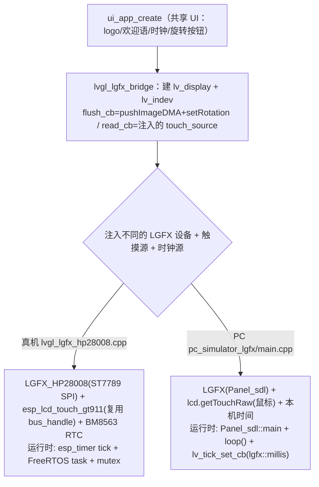

# hp28008 基于 LovyanGFX 的 LVGL 后端（真机 + PC）—— 设计文档 / Spec

- 日期：2026-07-05
- 状态：已实现（feature 分支 `cursor/hp28008-lvgl-lgfx-f919`，base `dev`）——设计经 brainstorming + grilling 逐条确认 G1–G11；Task 1–7 已落地，真机 `idf.py build` + PC 四方向旋转实测通过（含 问题 6 触摸旋转缺陷修复），详见 plan「执行结果」
- 主题：用 LovyanGFX 作为 LVGL 的显示后端，并列新增真机入口 `main_lvgl_lgfx.c` 与 PC 工程 `pc_simulator_lgfx/`，两端共用一份可移植 bridge 与同一份 `main/ui_app/` UI
- 关联分支：`cursor/hp28008-lvgl-lgfx-f919`（base `dev`）
- 前序：
  - [docs/superpowers/specs/2026-07-03-hp28008-lvgl-pc-sim-design.md](https://github.com/yuangezhizao/ESP-Pocket2/blob/dev/docs/superpowers/specs/2026-07-03-hp28008-lvgl-pc-sim-design.md)（方案 A：纯 LVGL SDL 的 `pc_simulator`；其第 4/10 节把「方案 C：LovyanGFX」列为后续，本设计即落地方案 C）

## 1. 背景与目标

ESP-Pocket2 现有的真机 LVGL 显示走 `main_lvgl.c` → `main/lvgl/hp28008.c`，用的是 Espressif 的 `esp_lcd` + `esp_lvgl_port`（ST7789 SPI 显示 + `esp_lcd_touch_gt911` 触摸 + BM8563 RTC）。PC 侧已有 `pc_simulator/`（纯 `lv_sdl`，复用 `main/ui_app/`）用于免烧录预览 UI（2026-07-03 的方案 A）。当时的设计文档在第 4/10 节记录了「方案 C：LovyanGFX（`LGFX_SDL` / `Panel_sdl`）」作为后续可选——其价值是让真机与 PC 共用一套 LovyanGFX 显示抽象。本设计即落地方案 C。

目标：在**不改动**现有 `main_lvgl.c` / `hp28008.c` / `pc_simulator/` 的前提下，**并列新增**一条基于 LovyanGFX 的 LVGL 路径：

- 真机新增入口 `main/main_lvgl_lgfx.c`：用 LovyanGFX 驱动 HP28008 显示（ST7789 SPI），渲染共享的 `main/ui_app/` 界面。
- PC 新增工程 `pc_simulator_lgfx/`：用 LovyanGFX 的 `Panel_sdl` 后端在电脑上跑同一份 `ui_app`，鼠标模拟触摸。
- 抽象一份**可移植 bridge**（`main/lvgl_lgfx/lvgl_lgfx_bridge.*`，仅依赖 LVGL + LovyanGFX），真机与 PC 共用同一份显示/输入桥接逻辑，各自只注入不同的 LGFX 设备实例、触摸源与时钟源。

## 2. 需求

功能需求：
- 真机 `main_lvgl_lgfx.c` 能用 LovyanGFX 点亮 HP28008 并渲染 `ui_app`（logo + 欢迎语 + 时钟 + 旋转按钮），触摸可交互、时钟为真实 BM8563 RTC。
- PC `pc_simulator_lgfx` 能在电脑上开窗显示同一份 `ui_app`，鼠标模拟触摸，时钟为本机时间。
- 真机与 PC 共用一份 bridge（显示 flush + 输入 read 的桥接）与同一份 `ui_app`。

非功能需求：
- **不改动** `main_lvgl.c` / `main/lvgl/hp28008.c` / `pc_simulator/`（esp_lcd 主线与方案 A 保持原样）。
- bridge **绝不依赖 esp-idf**（只 `#include` LVGL + LovyanGFX + `ui_app.h`），以便真机与 PC 复用同一份源码。
- 依赖变更仅限**新增底层 `esp_lcd_touch: "^1.2.1"` 直接约束**（保证 `esp_lcd_touch_get_data` 可用，见第 9 节 / plan Task 3）；除此**不新增其它 managed component**（`esp_lcd_touch_gt911` 已在 `main/idf_component.yml`）；**不改动 LovyanGFX 源码**；**不升级/切换 LovyanGFX 分支**（沿用当前 submodule 版本 1.2.9）。
- `main_lvgl_lgfx` 入口**仅支持 `CONFIG_SENSORLIB_ESP_IDF_NEW_API=y`（默认配置）**：它复用 `i2c_driver` 的 `bus_handle` 驱动 GT911，该符号仅在此配置下定义。因 main 组件对子目录源码「全量 GLOB 编译」，`lvgl_lgfx_hp28008.cpp` 用 `#if defined(CONFIG_SENSORLIB_ESP_IDF_NEW_API)` 包裹完整实现、`#else` 导出返回 `ESP_ERR_NOT_SUPPORTED` 的 stub（**不用顶层 `#error`**，否则 old API 配置下会波及所有入口的构建）。
- 真机需 **`CONFIG_LV_COLOR_DEPTH_16`（与 `hp28008.c`/LVGL 默认一致）**：bridge 按 RGB565（2 字节/px）分配 draw buffer 并 `flush`（`(lgfx::rgb565_t*)`）；若全局色深非 16，`esp_logo`(ARGB8888) 等会经历深度转换、且 `lv_color_t` 与 display 格式不匹配，故构建前须确认。PC 侧由 `lv_conf.h` 显式 `LV_COLOR_DEPTH 16` 保证。
- 编码时**禁止裸魔数**，分辨率/缓冲行数等一律用宏或 `sizeof`。

非目标（YAGNI）：
- 不替换 esp_lcd 主线（`main_lvgl.c` 仍是产品主力）。
- 不让 LovyanGFX 接管项目的 I2C 传感器（AXP202/BM8563）——见第 3 节，硬件与驱动约束使其不可行且无收益。
- 不为 `pc_simulator`（方案 A）做旋转性能优化——见第 8.3 节，PC 上无收益。
- 不做浏览器/WASM 分享、不做 CI headless 截图存档。

## 3. 关键约束与调查结论（LovyanGFX 与 esp-idf I2C 不可共存）

这是决定「路线 A」的核心。经代码级取证得出。

### 3.1 硬件 I2C 拓扑（ESP32-S3 默认，见 `main/Kconfig.projbuild` 与 `hp28008.h`）

- 项目 `i2c_driver` 承载 **AXP202 + BM8563 RTC**：I2C **port 0**、SDA=**GPIO47** / SCL=**GPIO48**、400kHz（`CONFIG_I2C_MASTER_PORT_NUM=0`、`CONFIG_PMU_I2C_SDA=47`、`CONFIG_PMU_I2C_SCL=48`）。
- GT911 触摸：`CONFIG_HP28008_USE_I2C_MASTER_BUS` 默认 `y`，`hp28008.c` 的 `app_touch_init()` 通过 `esp_lcd_new_panel_io_i2c(bus_handle, ...)` **复用同一条 port 0 总线**。
- 结论：真机上 **GT911 + AXP202 + BM8563 焊在同一条物理 I2C 总线（47/48）**，必须由同一套 I2C 驱动管理。

### 3.2 LovyanGFX 自建 I2C，无法与 esp-idf 驱动共存（代码级证据）

- LovyanGFX 是跨平台库，自带 `lgfx::i2c::` 命名空间的 I2C 实现，`cfg.i2c_port` 可填 0 或 1（`lgfx.cpp` 当前填 1 只是抄示例默认值，非限制）。
- 当前 submodule 版本 **1.2.9** 的 `esp32/common.cpp` 用 ESP-IDF **旧驱动**（`periph_module_enable` + `i2c_set_pin` + 直接操作 `I2C0` 寄存器），无 `i2c_new_master_bus`。
- 上游 **1.2.24** 虽以 `#if __has_include(<driver/i2c_master.h>)` 条件启用新驱动，但只用 `i2c_new_master_bus` 占坑初始化 port（`common.cpp` 第 1455 行，且**未检查返回值**），真正的读写仍是自带的寄存器级状态机（`save_reg`/`load_reg` 直接覆盖 `_reg_store[22]` 个寄存器）。
- LovyanGFX 的公开 i2c API（`namespace i2c` 的 `setPins`/`init(port[,sda,scl])`）**没有任何接受 `i2c_master_bus_handle_t` 的入口**；bus handle 存于私有 static `i2c_context[I2C_NUM_MAX]`，只能自建、无 setter、无 getter。
- 即便强凑同一 port，LovyanGFX 的寄存器级实现会与 esp-idf `i2c_master` 驱动（中断/命令队列/寄存器）**互相覆盖状态**，行为未定义。
- `cfg.bus_shared=true` 只协调 LovyanGFX **自己管理**的总线，不能与外部 esp-idf 驱动协调（官方建议：要共享须把外部设备也改用 `lgfx::i2c::` 驱动，即放弃 XPowersLib/SensorLib）。

### 3.3 结论

真机上让 LovyanGFX 与项目 I2C 传感器共享一条总线，只能靠改 LovyanGFX 源码（侵入式、脆弱），不可取。因此 **LovyanGFX 只承担它不可替代的「显示」职责（走 SPI，完全不碰 I2C）**；触摸（GT911）、PMU（AXP202）、RTC（BM8563）全部沿用项目现有的 esp-idf 官方驱动栈。

## 4. 方案选择：路线 A

**路线 A（采纳）**：LGFX 只做显示（SPI + PWM 背光），I2C 全交项目 esp-idf 驱动；触摸走项目已有的 `esp_lcd_touch_gt911`（复用同一 `bus_handle`），通过 bridge 的「触摸源注入」把坐标喂给 LVGL；时钟走真实 BM8563 RTC。

未采纳：
- 路线 B（全部走 LovyanGFX 旧驱动，用 `lgfx::i2c::` 手写 AXP202/BM8563）——丢弃 XPowersLib/SensorLib，工作量大。
- 路线 C（切 LovyanGFX develop/新驱动共享 `bus_handle`）——上游 1.2.24 无 handle 注入口、寄存器级实现与 esp-idf 互斥，且需换分支、不稳定。

## 5. 架构

### 5.1 分层与文件结构

三层清晰边界：`ui_app`（纯 UI）→ `lvgl_lgfx_bridge`（可移植桥接）→ 各平台适配 + LGFX 设备实例。

```
main/
  main_lvgl_lgfx.c            # 新·C 入口：I2C/PMU/RTC 初始化 → 调 lvgl_lgfx_hp28008_run()
  lgfx/
    lgfx.cpp                  # 改：#include lgfx_hp28008.hpp + 把全局 count 收进 lgfx_test()
    lgfx.h                    # 原
    lgfx_hp28008.hpp          # 新：ST7789 SPI 的 LGFX 设备类（lgfx_test 与 LVGL 入口共用）
  lvgl_lgfx/                  # 新目录
    lvgl_lgfx_bridge.hpp/.cpp # 可移植 bridge（仅依赖 lvgl + LovyanGFX + ui_app.h）：disp/indev 注册 + flush/read cb
    lvgl_lgfx_hp28008.cpp     # 真机适配：建 LGFX_HP28008 + esp_lcd_touch_gt911 + 调 bridge + 自管 LVGL 运行时；导出 C 接口
  ui_app/                     # 原·共享 UI（真机/PC 复用）
pc_simulator_lgfx/            # 新·PC LGFX 工程（与 pc_simulator 并列保留）
  main.cpp                    # Panel_sdl::main + setup/loop：建 PC LGFX(Panel_sdl) + 调同一 bridge
  lv_conf.h                   # LV_COLOR_DEPTH=16；关 LV_USE_SDL（显示走 LGFX，不走 lv_sdl）
  CMakeLists.txt              # LVGL FetchContent + LovyanGFX SDL 源 + SDL2 + ui_app + bridge + esp_logo
  README.md
```

分层要点：`lvgl_lgfx_bridge.*` 只 `#include` LVGL + LovyanGFX + `ui_app.h`，**绝不碰 esp-idf**，真机与 PC 共用同一份（这是「共用一套 LovyanGFX 抽象」的落点）；ESP 专属的东西（`esp_lcd_touch`、`i2c`、`esp_timer`/FreeRTOS 运行时）放 `lvgl_lgfx_hp28008.cpp`，PC 侧不编译它。

### 5.2 数据流



### 5.3 bridge 接口（概要，完整代码见 plan）

`lvgl_lgfx_bridge.hpp`（可移植，C++）导出一个创建函数，接收注入的 LGFX 设备、draw buffer、触摸源、时钟源；负责建 `lv_display` + 设 `flush_cb`（`pushImageDMA` + 旋转跟随）+ 建 `lv_indev` + 设 `read_cb`（调触摸源）+ `lv_display_set_buffers` + `ui_app_create`。**不**负责 `lv_init` / tick / `lv_timer_handler` 循环（这些平台相关，放各入口）。触摸源签名 `bool (*)(int32_t *x, int32_t *y)`（返回是否按下，坐标为原生 rotation-0 坐标、旋转由 LVGL 统一负责，见 D7/8.1）；时钟源复用 `ui_app.h` 的 `ui_clock_source_fn`。

## 6. 关键设计决策（D1–D11，对应 grilling G1–G11）

- **D1（G1）共享一份 bridge**：flush + 输入 read 的桥接抽成可移植的 `lvgl_lgfx_bridge.*`，真机/PC 只注入各自的 LGFX 设备实例、触摸源、时钟源。依据：LovyanGFX 的 `startWrite`/`pushImage(DMA)`/`getTouch` 在真机与 SDL 后端 API 一致，桥接逻辑天然可共享。
- **D2（G2）真机自管 LVGL**：`esp_lvgl_port` 的 `add_disp`/`add_touch` 强绑 esp_lcd handle，LGFX 无此 handle 故用不了；且 `esp_lvgl_port` 为 ESP 专属、与共享 bridge 矛盾。故 bridge 用纯 LVGL API（`lv_display_create`/`lv_display_set_flush_cb`/`lv_indev_create`）；平台运行时（tick/循环/锁）放各入口——真机照搬 `lvgl_qemu_rgb.c` 的 `esp_timer` tick + FreeRTOS task + recursive mutex，PC 用 `Panel_sdl::main` + `loop()` + `lv_tick_set_cb`。
- **D3（G3）提取共享 LGFX 设备类**：把 HP28008 的 `LGFX` 设备定义从 `lgfx.cpp` 抽到 `main/lgfx/lgfx_hp28008.hpp`（类名 `LGFX_HP28008`），`lgfx_test()` 与真机 LVGL 入口共用；顺手把 `lgfx.cpp` 的非 static 全局 `count` 收进 `lgfx_test()` 内部，消除全局符号污染。不动 `hp28008.c`。
- **D4/D5（G4/G5）真机 I2C 归属**：真机 LGFX 入口沿用 `main_lvgl.c` 的硬件初始化（`i2c_drv_init`/`axp202_init`/`i2c_drv_scan`/`bm8563_init`），时钟为真实 BM8563 RTC；LGFX 设备类**不 `setTouch`**（不碰 I2C）；触摸由 `main_lvgl_lgfx` 侧**自带一份** `esp_lcd_touch_gt911` 初始化（复用同一 `bus_handle`，与 `hp28008.c` 少量相似代码），不改 `hp28008.c`。
- **D6（G6）色深/字节序**：色深统一 RGB565（`LV_COLOR_DEPTH 16`）；bridge 的 `flush_cb` 统一把 `px_map` 当 `lgfx::rgb565_t*` 交给 LGFX（LVGL v9 的 RGB565 内存布局与 `lgfx::rgb565_t` 一致），字节序由 LGFX 内部转成各平台面板格式，两端 flush_cb 逐字一致；不在 LVGL 侧做 swap。面板 `invert`/`rgb_order` 见 `lgfx_hp28008.hpp`：`invert=true`（真机实测该 ST7789/IPS 需 display inversion/INVON 才正常显色，与 `hp28008.h` 的 `EXAMPLE_LCD_INVERT_COLOR=1` 等效；`invert=false` 时整屏反相）、`rgb_order=false`（真机实测 `rgb_order=true` 时 R/B 通道对调（红→蓝、按钮蓝→橙），改 `false`=MADCTL BGR；LGFX 的 `rgb_order` 与 esp_lcd `COLOR_SPACE` 不同源、以实测为准）。
- **D7（G7）旋转用 LGFX `setRotation`（方案 B）**：`ui_app` 旋转按钮保持调 `lv_display_set_rotation()`（可移植、不依赖 LGFX，仅换逻辑分辨率使 UI 重排）；bridge 在 `flush_cb` 感知 rotation 变化时调 `lcd.setRotation()` 做坐标映射（真机 = ST7789 MADCTL 硬件旋转、省 CPU；PC = `Panel_sdl` 软件坐标映射）。不用 `lv_draw_sw_rotate`。**触摸坐标（实现订正，见第 9 节问题 6）**：read_cb 一律回传**原生（rotation-0）物理坐标**，旋转统一由 LVGL v9 的 `indev_pointer_proc`→`lv_display_rotate_point` 负责（LVGL 对 read_cb 坐标**无条件**再旋转、期望原生坐标）——故 PC 用 `lcd.getTouchRaw()`（非 `getTouch`）、真机 `esp_lcd_touch` 读出即原样回传，**均不再手动按 rotation 变换**。又因 LVGL `rotate_point` 与 LovyanGFX `setRotation` 旋转手性相反，bridge 的 `flush_cb` 显示取 `setRotation((4-rot)&3)` 使显示方向与 LVGL 触摸方向一致（否则「显示位置」与「触摸命中区」互为镜像）；物理基线（左右/上下/交换）真机用 `esp_lcd_touch` 的 `flags.swap_xy/mirror_x/mirror_y` 校准（本板已实测四角正确、flags 全 0）。
- **D8（G8）draw buffer（档 2：DMA + 双缓冲）**：`LV_DISPLAY_RENDER_MODE_PARTIAL`；行数 50（对齐 `hp28008.c`）；双缓冲；真机用内部 RAM 且 DMA-capable（`heap_caps_malloc(size, MALLOC_CAP_DMA | MALLOC_CAP_8BIT)`），PC 用普通内存；buffer 由各入口分配、指针交给 bridge。flush 用 `pushImageDMA` + `lv_display_flush_ready`（做法对齐官方 LovyanGFX+LVGL 例程）。注意：`pushImageDMA` 本身异步提交，但随后 `endWrite()`（`Panel_LCD::end_transaction` 内 `_bus->wait()`）会在本次 flush 内**同步等待 DMA 完成**，故属**安全的 DMA flush**；LVGL 渲染与 SPI 传输的真正重叠有限，双缓冲主要保证多 buffer 轮转安全而非异步重叠，最终帧率以真机实测为准。
- **D9（G9）PC 主循环模型**：用 `lgfx::Panel_sdl::main(user_func)` + `setup()/loop()`（Arduino 风格）——主线程跑 SDL 事件泵 + 渲染呈现，`user_func` 子线程跑 `setup()`（`lv_init` + 建 LGFX + bridge + `ui_app`）与 `loop()`（`lv_timer_handler`）。LVGL 全在子线程单线程使用（安全）；`Panel_sdl` 绘图/呈现跨线程由其内部 `_sdl_mutex` 保护，无需额外加锁。
- **D10（G10）文件/CMake/符号**：见第 5.1 节结构。`main/CMakeLists.txt` 新增 `LVGL_LGFX_CPP_SOURCES` GLOB（`lvgl_lgfx/*.cpp`）+ `INCLUDE_DIRS "lvgl_lgfx"` + 把 SRCS 生效入口切到 `main_lvgl_lgfx.c`（注释旧 `main_lvgl_qemu_rgb.c`，本 PR 以 LGFX 入口为默认 demo）。因 `main/CMakeLists.txt` 是 `GLOB_RECURSE` 全量编译，bridge/适配的导出符号统一加前缀 `lvgl_lgfx_` 以避免与 `hp28008.c` 的 `app_*` 撞名。PC 侧 `CMakeLists.txt` 复用 `pc_simulator` 骨架（LVGL FetchContent v9.5.0 + `lv_conf.h` + 删 `lv_blend_helium.S` + venv 生成 `esp_logo.c`）并新增 LovyanGFX SDL 源（参照 `examples_for_PC/CMake_SDL`）+ `-DLGFX_SDL`；`project(... C CXX)`；SDL2 链接给 LovyanGFX+入口（关 `LV_USE_SDL` 后 LVGL 不碰 SDL）。
- **D11（G11）命名**：前缀统一 `lvgl_lgfx_`（对齐入口 `main_lvgl_lgfx.c` ↔ 目录 `lvgl_lgfx/` ↔ 文件 `lvgl_lgfx_*`，遵仓库 `lvgl_qemu_rgb` 惯例）；bridge 用 `lvgl_lgfx_bridge`（不用 `_port`，避免与 `esp_lvgl_port` 混淆）；`lgfx_hp28008.hpp` 保留（在 `lgfx/` 下、纯 LGFX 定义）；PC 工程 `pc_simulator_lgfx/`（对称现有 `pc_simulator/`）。

## 7. 编码规范（宏，禁止裸魔数）

- `240/320`：`ui_app`/PC/bridge 侧复用 `ui_app.h` 的 `UI_APP_HOR_RES`/`UI_APP_VER_RES`；`lgfx_hp28008.hpp` 因需保持“零 LVGL 依赖”（供纯 LovyanGFX 的 `lgfx_test` 复用），单独定义 `HP28008_LGFX_PANEL_W/H`，与 `UI_APP_*`、`hp28008.h` 的 `EXAMPLE_LCD_H_RES/V_RES` **三处约定同值**，注释交叉标注（同仓库既有 `ui_app.h`↔`hp28008.h` 的“跨 ESP/非 ESP 无法共享单一头、约定同值”先例）。
- draw buffer 行数 `50` → 新增宏（如 `LVGL_LGFX_DRAW_BUFF_HEIGHT`，定义于 bridge 头或真机适配处）。
- 每像素字节 → 用 `sizeof(lgfx::rgb565_t)`，不写裸 `2`。
- 所有示例代码在 plan 落地时均替换为宏/`sizeof`。

## 8. 细节澄清

### 8.1 触摸

真机不用手写 GT911 驱动：`main/idf_component.yml` 已声明 `esp_lcd_touch_gt911: "^1.2.0"`，`hp28008.c` 已用 `esp_lcd_touch_new_i2c_gt911` 初始化它。真机适配 `lvgl_lgfx_hp28008.cpp` 自带一份同样的初始化（复用 `bus_handle`，持有自己的 `touch_handle`），在触摸源回调里用 `esp_lcd_touch_read_data` + `esp_lcd_touch_get_data`（`esp_lcd_touch_point_data_t`）读坐标（`get_coordinates` 自 esp_lcd_touch 1.2.1 起 deprecated；已在 `idf_component.yml` 约束 `esp_lcd_touch ^1.2.1`），读出后**原样回传原生坐标**（旋转交给 LVGL，见 D7 订正）。PC 侧触摸源用 `lcd.getTouchRaw()`（`Panel_sdl` 把 SDL 鼠标当触摸，返回未经 `setRotation` 变换的原生窗口坐标；**不用 `getTouch`**，否则叠加 LVGL 旋转成双重旋转）。

### 8.2 DMA + swap 与 esp_lvgl_port 的关系

`main_lvgl.c` 没手写 flush_cb，是因为 `esp_lvgl_port` 内部实现了它：`hp28008.c` 的 `disp_cfg` 用 `flags.buff_dma=true`（DMA）+ `flags.swap_bytes=true`（软件字节交换）+ `double_buffer=1` 声明式开启，flush/DMA/swap 全在 port 内部。LGFX 版没有这层封装，故 flush_cb 自己写（bridge），DMA/swap 由 `pushImageDMA(rgb565_t)` + LGFX 内部完成，性能与 `hp28008.c`（软件 swap + DMA）相当。

### 8.3 为何 `pc_simulator`（方案 A）不做旋转优化

旋转省 CPU 的本质是真机 ST7789 的 MADCTL 硬件旋转（B 方案在真机的红利）。PC 无真实面板 MADCTL，任何「UI 重排旋转」必落到软件层（`lv_draw_sw_rotate` 或 LGFX 写 framebuffer 的坐标映射，两者 PC 上开销相当，换 LGFX 不省）。`Panel_sdl` 唯一能 GPU 加速的 `setFrameRotation`（`SDL_RenderCopyEx`）不重排 UI、语义不符。而 PC 上旋转只在点按钮时发生一次（非每帧）、算力充裕，开销无感。故 `pc_simulator` 维持现状。

## 9. 验证策略

本仓库无单测/lint，验证以「构建通过 + 运行观察（含截图）」为准。

- 真机构建：`main/CMakeLists.txt` 的 `SRCS` 生效入口已切到 `main_lvgl_lgfx.c`（注释旧 `main_lvgl_qemu_rgb.c`、随 `feat(main)` 提交），`idf.py build` 通过（无符号冲突、无 v9 API 错误）。
- QEMU 冒烟（有限）：`app_main` 会先做 AXP202/BM8563/GT911 等真实 I2C 外设初始化，QEMU 无这些外设，故会在某外设初始化阶段 `ESP_ERROR_CHECK` abort（abort 点不定，大概率 `bm8563_init()`；`axp202_init()` built-in 分支失败 `return false`≈`ESP_OK` 可能被放过），通常进不到 LGFX 显示/触摸——均属预期。QEMU 不适合验证本真机入口，验证以 `idf.py build` + 真机实测为准（详见 plan Task 4 Step 2）。
- 真机实测（关键）：烧录后确认 `ui_app` 显示正常（logo/欢迎语/时钟）、颜色正确（已实测 invert/rgb_order 修正、对照 `lgfx_test()`）、触摸可点（rotation-0 四角基线已实测正确、flags 全 0）、旋转按钮 0/90/180/270 各档旋转方向与触摸对齐（已真机逐档实测通过）——**必须截图/拍照**（图形行为不能只看日志，PR5/pc_simulator 教训）。
- PC：`cmake -S pc_simulator_lgfx -B pc_simulator_lgfx/build && cmake --build pc_simulator_lgfx/build --parallel`，运行出现 240×320 窗口、显示 `ui_app`、鼠标点「Rotate screen」可旋转；云端 `DISPLAY=:1` + 截图核对。
- **PC 旋转交互测试（cloud 可自动化，本轮已执行）**：无头环境用 `xdotool` 模拟点击 + `ffmpeg` 截图验证旋转闭环——
  1. 后台启动模拟器（`DISPLAY=:1 ... &`），`xdotool getwindowgeometry` 取窗口位置（本轮 841,468，尺寸恒 240×320，不随旋转变）。
  2. 每步用 `ffmpeg -f x11grab -video_size 240x320 -i :1.0+<x>,<y>` 精确截取窗口，从截图定位「Rotate screen」按钮**当前显示位置**，换算屏幕坐标。
  3. `xdotool mousemove <sx> <sy>; mousedown 1; sleep 0.3; mouseup 1`（间隔确保 LVGL indev 采样到 press）点击该位置，再截图看是否旋转到下一档。
  4. 判据：**点击「屏幕上看到的按钮位置」即命中并旋转**，连续点走完 0→90→180→270→0；若显示位置点不中（需点镜像位置才中）即为 问题 6 未修。
- **问题 6（触摸双重旋转 + 方向不匹配）与结论**：LVGL v9 `indev_pointer_proc` 无条件对 read_cb 坐标再做 `lv_display_rotate_point`。原设计（PC `getTouch` 返回逻辑坐标 / 真机手动 switch 变换）与之叠加成双重旋转；仅改 read_cb 回传原生坐标后仍有「显示 vs 触摸方向相反」（LVGL 与 LovyanGFX 旋转手性不同）。**最终修复 = read_cb 原生坐标 + bridge `setRotation((4-rot)&3)`**。本轮 **PC 已实测四方向闭环通过**（每档点击显示的按钮位置均命中，0→90→180→270→0，截图留证于 PR）。真机共用同一 bridge、逻辑一致；颜色已真机实测修复（`invert=false` 背景反相→`invert=true`；`rgb_order=true` 时 R/B 对调→改 `false`）、触摸 rotation-0 四角基线已实测正确（`flags` 全 0）、0/90/180/270 逐档旋转+触摸对齐已实测通过（见上「真机实测」）。

## 10. 后续演进（本设计不含）

- 若真机实测帧率不足：把 flush 优化为「LVGL 输出 swap565 + `pushImageDMA(swap565_t)`」（G6 档 3，会削弱 bridge 两端统一性，权衡后再做）。
- 若数据点变多：`ui_app` 从「回调注入」演进到 LVGL v9 Observer/Subject（沿用 2026-07-03 spec 附录 A）。
- 浏览器/WASM 分享、CI headless 截图存档。

## 11. QA 记录（设计决策 / grilling 问答留档）

> 说明：本节仅留档**设计决策**（grilling G1–G11 及关键约束的取舍依据），供理解「为何如此设计」。**逐轮 review 的过程记录不纳入本 spec**（按 ADR / design-doc 最佳实践，归于 git 提交历史 / PR 讨论）；spec 正文（第 1–10 节）与 plan 已反映最终设计。

1. **范围？** 方案 C 的并列新增：真机新增 `main_lvgl_lgfx.c`（不动 `main_lvgl.c`），PC 新增 `pc_simulator_lgfx`（保留现有 `pc_simulator`）。
2. **grilling 技能是否有必要加载？** 有价值（决策点密集且相互依赖），已安装到当前 VM 的 superpowers 插件目录并本会话应用；持久化到未来 cloud agent 需 Cursor 插件设置或纳入仓库/环境（未做）。
3. **G1 bridge 是否共享？** 共享一份可移植 bridge（a）。
4. **G2 真机 LVGL 运行时？** 自管 LVGL（a）；`esp_lvgl_port` 的 `add_disp`/`add_touch` 强绑 esp_lcd handle、用不了，且 ESP 专属与共享 bridge 矛盾。
5. **LGFX 能否用 esp_lvgl_port？真机用 port + PC 用纯 API 是否就不能共享 bridge？** 能否共享取决于 bridge 边界：只要把平台运行时排除在 bridge 外，真机即使半复用 esp_lvgl_port 也能共享 bridge；但结论选自管 LVGL（对称、干净）。
6. **G3 LGFX 设备类复用？** 提取 `lgfx_hp28008.hpp` 共享（a），收编全局 `count`，不动 `hp28008.c`。
7. **G4/G5 真机 I2C/时钟？** 真实传感器 + 真实 RTC；LGFX 只显示；触摸走 `esp_lcd_touch_gt911` 复用项目 bus。
8. **LGFX 内建触摸只有 port 1 吗？为何？** 不是，`i2c_port` 可填 0 或 1；LovyanGFX 跨平台故自带 `lgfx::i2c::`（当前版本用 esp-idf 旧驱动、寄存器级）。
9. **真机想用项目 I2C 传感器怎么办？** GT911+AXP202+BM8563 物理同总线，须同一驱动栈；LGFX 自建 I2C 与 esp-idf 互斥，故 LGFX 只显示、I2C 全交项目（路线 A）。
10. **1.2.24 是否用新驱动？切版本后能把 handle 传给 LGFX 吗？还需手写 AXP202/BM8563 吗？** 1.2.24 条件启用新驱动但只「占坑」、传输仍寄存器级；无 handle 注入 API、且寄存器级与 esp-idf 高层驱动互斥；即便新驱动共享也不可靠。故不换版本，仍路线 A。
11. **为何 `main_lvgl.c` 无此问题？** 它全程只用一套 I2C 驱动（esp-idf 官方，`esp_lcd_touch`/XPowersLib/SensorLib 共享同一 `bus_handle`）；LGFX 会引入第二套自带 I2C，两套抢同一物理总线才冲突。
12. **GT911 需额外用官方驱动吗？** 不用手写，复用已有 `esp_lcd_touch_gt911`；真机适配自带一份初始化（复用 bus），不动 `hp28008.c`（a）。
13. **G6 色深/字节序？** RGB565 + bridge 传 `rgb565_t` 交 LGFX（档 2）。
14. **DMA+swap565 是什么？`main_lvgl.c` 为何没手写 flush_cb？** 见 8.2；`esp_lvgl_port` 用 `buff_dma`/`swap_bytes` 标志内部实现了 flush+DMA+swap。
15. **G6 传输档位？** 档 2：`pushImageDMA(rgb565_t)` + 双缓冲（对齐 hp28008 性能、保 bridge 统一）。
16. **G7 旋转？** LGFX `setRotation`（方案 B）；`ui_app` 仍调 `lv_display_set_rotation`。**触摸（实现订正）**：read_cb 回传原生坐标、由 LVGL `lv_display_rotate_point` 统一旋转（真机/PC 均不手动变换）；因 LVGL 与 LovyanGFX 旋转手性相反，bridge 显示取 `(4-rot)&3` 对齐，物理基线用 `esp_lcd_touch` flags 校准（详见 D7 与第 9 节 问题 6）。
17. **能否用 B 优化 pc_simulator 旋转？** 不建议（见 8.3）；B 的省 CPU 只在真机 MADCTL 兑现，PC 无收益，维持现状。
18. **G8 buffer？** 内部 RAM DMA-capable、50 行、双缓冲、PARTIAL；buffer 各入口分配传 bridge；`pushImageDMA` + `flush_ready` 双缓冲保证安全。
19. **常量要用宏。** 采纳（第 7 节）。
20. **G9 PC 主循环？** `Panel_sdl::main` + setup/loop；LVGL 子线程单线程、`Panel_sdl` 内部 mutex 保证跨线程安全。
21. **G10 文件/CMake/符号？** 见 5.1/D10；符号前缀 `lvgl_lgfx_`；PC `project(C CXX)` + `-DLGFX_SDL` + 复用 pc_simulator 骨架 + LovyanGFX SDL 源。
22. **G11 命名？** 前缀统一 `lvgl_lgfx_` + bridge 用 `bridge`。
23. **提交时机？** 设计轮只写工作区、暂不提交（b）；已于本 PR 随 feature 一并提交。
24. **`.hpp`/`.h` 后缀规范？** 纯 C++（含 `lgfx::` 等、无 C 可调用接口）→ 头 `.hpp`/实现 `.cpp`；可被 C 引用/含 C 接口/纯宏配置 → `.h`。本方案：`lgfx_hp28008.hpp`、`lvgl_lgfx_bridge.hpp` 为纯 C++（`.hpp`）；`main_lvgl_lgfx.c` 为纯 C（`.c`）；`lv_conf.h` 为 C/C++ 通用（`.h`）。与项目既有惯例（`main/` 头全 `.h`、含 C++ 者以 `extern "C"` 保 C 可用）一致。
25. **bridge 头是否加 `extern "C"`？** 否。`lvgl_lgfx_bridge.hpp` 为纯 C++（cfg 含 `lgfx::LGFX_Device*`），无 C 调用者，去掉无意义的 `extern "C"`；真正的 C↔C++ 边界是 `lvgl_lgfx_hp28008.cpp` 导出的 `extern "C" lvgl_lgfx_hp28008_run()`（供 `main_lvgl_lgfx.c` 调用）。
26. **真机 LVGL 色深前提？** `CONFIG_LV_COLOR_DEPTH_16`（与 `hp28008.c`/LVGL 默认一致）；bridge 按 RGB565（2 字节/px）分配 buffer 与 flush，构建前须确认。
27. **bridge 的 per-display 运行时状态如何存储？可否多 display 并存？**（实现/review 阶段补充的设计澄清，非 grilling G1–G11 原议题）每个 `lv_display`/bridge 的运行时状态（注入的 LGFX 设备、触摸源、上次旋转档）打包为一份 context，`lv_malloc` 后挂在 `lv_display` 的 `user_data`；`flush_cb`/`read_cb` 各自从 `user_data` 取（`read_cb` 经 `lv_indev_get_display` 拿到 display 再取），**不用文件级 static**——故 bridge 层无全局 static、状态按 display 隔离、可重入；但 UI 层 `ui_app` 仍为文件级单实例（第二次 `ui_app_create` 会被 guard 拦、不建 UI），多 display 时仅首个有完整 UI。真机固件与 PC 程序本是独立进程、各建一个 display（多屏/多 display 非本设计需求：第 2 节需求仅真机单屏 + PC 单窗），此设计意在消除全局状态、不为单实例假设留隐患。ctx 随 display 生命周期存在，并由 `lv_display` 的 `LV_EVENT_DELETE` 回调 `lv_free` 释放（**ctx 不泄漏**；注：bridge 另建的 `indev` 在 `lv_display_delete` 时仅被 detach、LVGL 不自动删，完整销毁/重建还需另行 `lv_indev_delete`——当前 demo 单 display 不销毁故不涉及；`buf1`/`buf2` 仍为一次性分配、随进程回收）。

## 12. 参考

- LovyanGFX 官方 LVGL 例程（flush/touch 桥接范式，v8 需适配 v9）：`components/LovyanGFX/examples/Advanced/LVGL_PlatformIO/src/main.cpp`
- LovyanGFX PC/SDL 例程（`Panel_sdl::main` + `-DLGFX_SDL`）：`components/LovyanGFX/examples_for_PC/CMake_SDL/`
- LovyanGFX I2C 实现（旧驱动/寄存器级）：`components/LovyanGFX/src/lgfx/v1/platforms/esp32/common.cpp`
- LovyanGFX I2C 迁移新驱动的讨论：https://github.com/lovyan03/LovyanGFX/issues/675
- esp-idf 新旧 I2C 驱动不可混用：https://github.com/espressif/esp-bsp/issues/566
- LVGL SDL（PC 模拟，方案 A 对照）：https://lvgl.io/docs/open/9.5/integration/pc/sdl.html
- 前序 spec（方案 A / QEMU RGB）：见文首「前序」。
